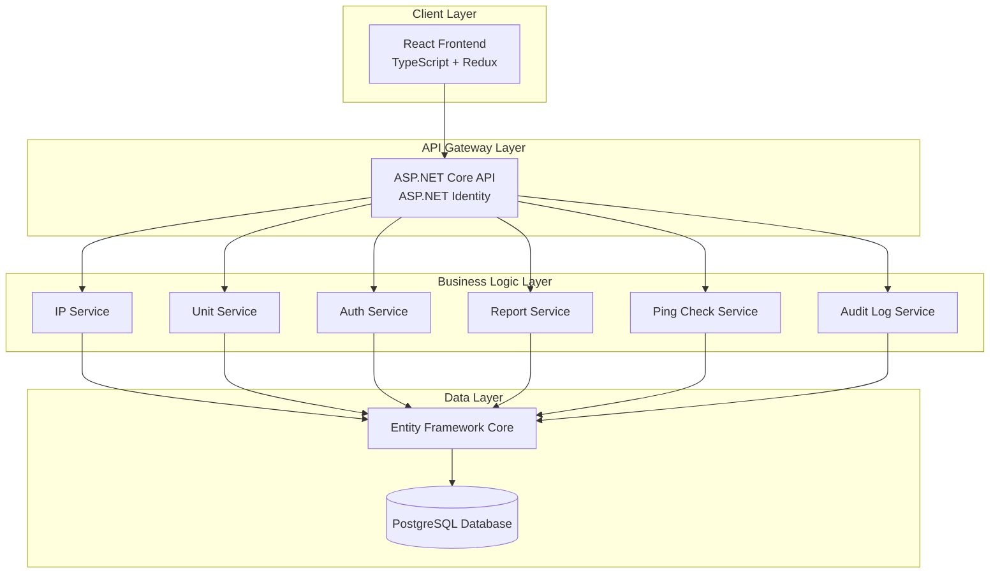
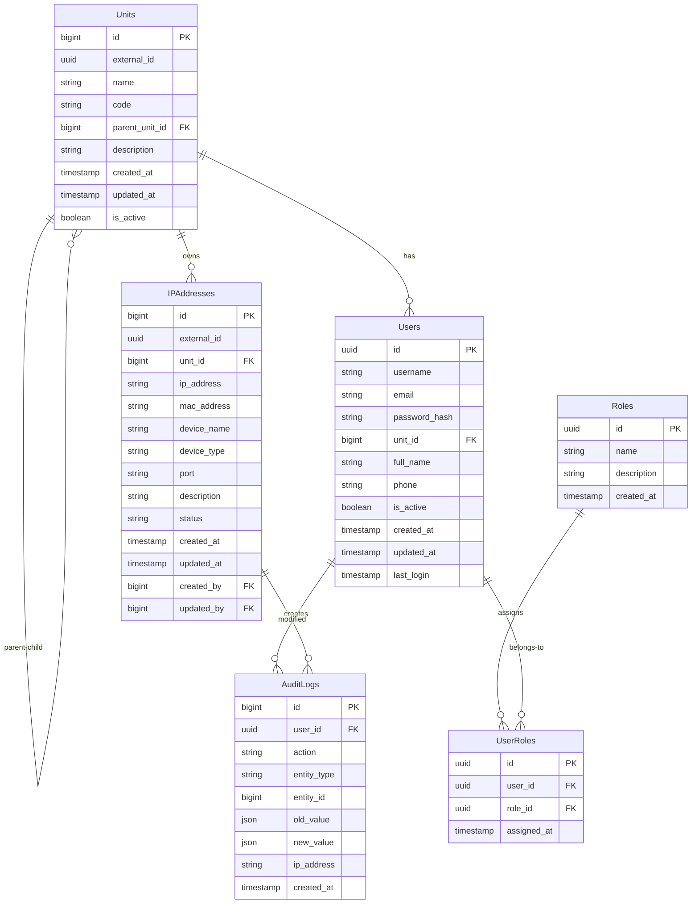
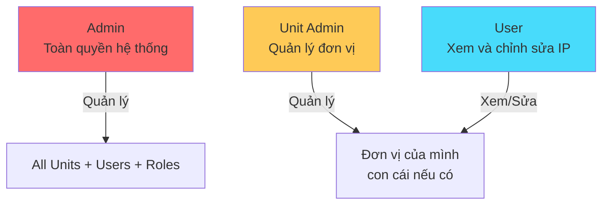
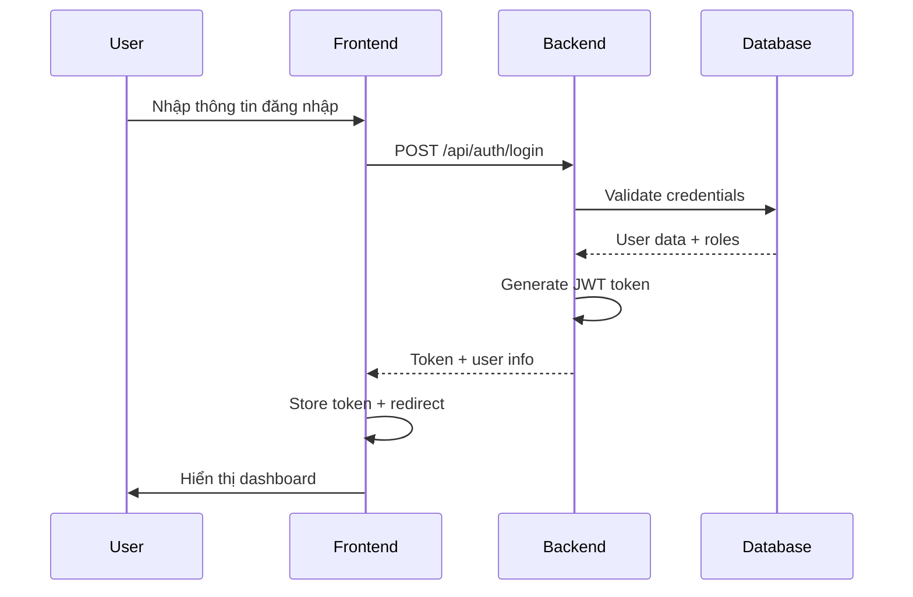
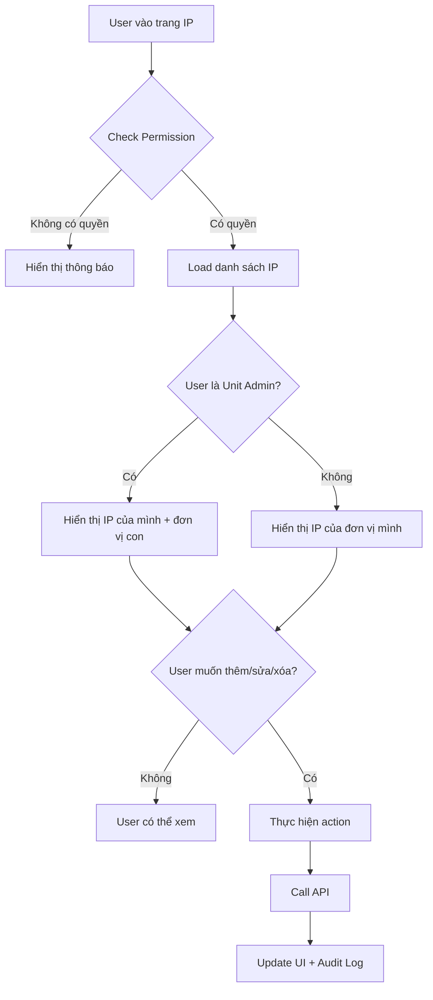

# Phương Án Kiến Trúc - Phần Mềm Quản Lý Địa Chỉ IP

## 1. Tổng Quan Dự Án

### 1.1 Mô Tả
Phần mềm quản lý địa chỉ IP cho phép các đơn vị quản lý IP của mình với hệ thống phân cấp đơn vị và phân quyền chi tiết.

### 1.2 Công Nghệ Sử Dụng
- **Backend**: ASP.NET Core 8.0
- **Frontend**: React 18+ với TypeScript
- **Cơ Sở Dữ Liệu**: PostgreSQL 15+
- **ORM**: Entity Framework Core
- **Xác Thực**: ASP.NET Identity + JWT
- **State Management**: Redux Toolkit
- **UI Framework**: Ant Design hoặc Material-UI

---

## 2. Kiến Trúc Hệ Thống



---

## 3. Thiết Kế Cơ Sở Dữ Liệu

### 3.1 Mô Hình Dữ Liệu



### 3.2 Chi Tiết Bảng

#### 3.2.1 Bảng Units (Đơn vị)
| Cột | Kiểu | Mô tả |
|-----|------|-------|
| id | BIGSERIAL | Khóa chính |
| external_id | UUID | ID duy nhất cho API |
| name | VARCHAR(200) | Tên đơn vị |
| code | VARCHAR(50) | Mã đơn vị |
| parent_unit_id | BIGINT | Đơn vị cha (NULL cho cấp cao nhất) |
| description | TEXT | Mô tả |
| created_at | TIMESTAMP | Ngày tạo |
| updated_at | TIMESTAMP | Ngày cập nhật |
| is_active | BOOLEAN | Trạng thái hoạt động |

#### 3.2.2 Bảng Users (Người dùng)
| Cột | Kiểu | Mô tả |
|-----|------|-------|
| id | UUID | Khóa chính (Identity) |
| username | VARCHAR(100) | Tên đăng nhập |
| email | VARCHAR(255) | Email |
| password_hash | TEXT | Mật khẩu đã mã hóa |
| unit_id | BIGINT | Đơn vị thuộc về |
| full_name | VARCHAR(200) | Họ tên |
| phone | VARCHAR(20) | Số điện thoại |
| is_active | BOOLEAN | Trạng thái |
| created_at | TIMESTAMP | Ngày tạo |
| updated_at | TIMESTAMP | Ngày cập nhật |
| last_login | TIMESTAMP | Lần đăng nhập cuối |

#### 3.2.3 Bảng Roles (Vai trò)
| Cột | Kiểu | Mô tả |
|-----|------|-------|
| id | UUID | Khóa chính |
| name | VARCHAR(50) | Tên vai trò |
| description | TEXT | Mô tả |

#### 3.2.4 Bảng IPAddresses (Địa chỉ IP)
| Cột | Kiểu | Mô tả |
|-----|------|-------|
| id | BIGSERIAL | Khóa chính |
| external_id | UUID | ID duy nhất |
| unit_id | BIGINT | Đơn vị sở hữu |
| ip_address | VARCHAR(45) | Địa chỉ IP (IPv4/IPv6) |
| mac_address | VARCHAR(17) | Địa chỉ MAC |
| device_name | VARCHAR(200) | Tên thiết bị |
| device_type | VARCHAR(100) | Loại thiết bị |
| port | VARCHAR(50) | Cổng kết nối |
| description | TEXT | Mô tả |
| status | VARCHAR(20) | Trạng thái (active/inactive/reserved) |
| created_at | TIMESTAMP | Ngày tạo |
| updated_at | TIMESTAMP | Ngày cập nhật |
| created_by | UUID | Người tạo |
| updated_by | UUID | Người cập nhật |

#### 3.2.5 Bảng AuditLogs (Nhật ký audit)
| Cột | Kiểu | Mô tả |
|-----|------|-------|
| id | BIGSERIAL | Khóa chính |
| user_id | UUID | Người thực hiện |
| action | VARCHAR(20) | Action (CREATE/UPDATE/DELETE) |
| entity_type | VARCHAR(50) | Loại entity |
| entity_id | BIGINT | ID entity |
| old_value | JSON | Giá trị cũ |
| new_value | JSON | Giá trị mới |
| ip_address | VARCHAR(45) | IP của người thực hiện |
| created_at | TIMESTAMP | Thời điểm |

---

## 4. Hệ Thống Phân Quyền

### 4.1 Vai Trò (Roles)



### 4.2 Chi Tiết Quyền Hạn

| Quyền | Admin | Unit Admin | User |
|-------|-------|------------|------|
| Quản lý User | ✅ | ❌ | ❌ |
| Quản lý Unit | ✅ | ✅ (của mình) | ❌ |
| Quản lý Role | ✅ | ❌ | ❌ |
| Xem IP tất cả đơn vị | ✅ | ✅ (của mình + con) | ✅ (của mình) |
| Thêm IP | ✅ | ✅ (của mình + con) | ✅ (của mình) |
| Sửa IP | ✅ | ✅ (của mình + con) | ✅ (của mình) |
| Xóa IP | ✅ | ✅ (của mình + con) | ✅ (của mình) |
| Xem Audit Log | ✅ | ✅ (của mình) | ❌ |
| Xuất báo cáo | ✅ | ✅ (của mình) | ❌ |

### 4.3 Policy-Based Authorization

```csharp
// Các policy cần thiết
- "CanManageAll": Admin duy nhất
- "CanManageUnit": Unit Admin có thể quản lý đơn vị
- "CanViewIP": Tất cả user được xem IP
- "CanEditIP": User có thể sửa IP của đơn vị mình
- "CanDeleteIP": User có thể xóa IP của đơn vị mình
- "CanViewUnitChildren": Unit Admin xem được đơn vị con
```

---

## 5. API Endpoints

### 5.1 Authentication

| Method | Endpoint | Mô tả | Role |
|--------|----------|-------|------|
| POST | `/api/auth/login` | Đăng nhập | Public |
| POST | `/api/auth/logout` | Đăng xuất | Auth |
| POST | `/api/auth/refresh-token` | Làm mới token | Auth |
| GET | `/api/auth/profile` | Lấy thông tin user | Auth |
| PUT | `/api/auth/change-password` | Đổi mật khẩu | Auth |

### 5.2 Users

| Method | Endpoint | Mô tả | Role |
|--------|----------|-------|------|
| GET | `/api/users` | Danh sách user | Admin |
| GET | `/api/users/{id}` | Chi tiết user | Admin |
| POST | `/api/users` | Tạo user | Admin |
| PUT | `/api/users/{id}` | Cập nhật user | Admin |
| DELETE | `/api/users/{id}` | Xóa user | Admin |
| GET | `/api/users/unit/{unitId}` | User của đơn vị | Admin, Unit Admin |

### 5.3 Units

| Method | Endpoint | Mô tả | Role |
|--------|----------|-------|------|
| GET | `/api/units` | Danh sách đơn vị | Admin |
| GET | `/api/units/tree` | Cây đơn vị | Admin |
| GET | `/api/units/{id}` | Chi tiết đơn vị | Admin, Unit Admin |
| POST | `/api/units` | Tạo đơn vị | Admin |
| PUT | `/api/units/{id}` | Cập nhật đơn vị | Admin, Unit Admin |
| DELETE | `/api/units/{id}` | Xóa đơn vị | Admin |
| GET | `/api/units/my-unit` | Đơn vị của tôi | Auth |

### 5.4 IP Addresses

| Method | Endpoint | Mô tả | Role |
|--------|----------|-------|------|
| GET | `/api/ip-addresses` | Danh sách IP | Auth |
| GET | `/api/ip-addresses/{id}` | Chi tiết IP | Auth |
| POST | `/api/ip-addresses` | Tạo IP | Auth, Unit Admin |
| PUT | `/api/ip-addresses/{id}` | Cập nhật IP | Auth, Unit Admin |
| DELETE | `/api/ip-addresses/{id}` | Xóa IP | Auth, Unit Admin |
| GET | `/api/ip-addresses/search` | Tìm kiếm IP | Auth |
| POST | `/api/ip-addresses/check-status` | Kiểm tra trạng thái | Auth, Unit Admin |
| GET | `/api/ip-addresses/duplicates` | Tìm IP trùng | Admin, Unit Admin |

### 5.5 Reports

| Method | Endpoint | Mô tả | Role |
|--------|----------|-------|------|
| GET | `/api/reports/ip-summary` | Báo cáo tổng hợp | Admin, Unit Admin |
| GET | `/api/reports/ip-by-unit` | Báo cáo theo đơn vị | Admin, Unit Admin |
| GET | `/api/reports/export/excel` | Xuất Excel | Admin, Unit Admin |
| GET | `/api/reports/export/pdf` | Xuất PDF | Admin, Unit Admin |

### 5.6 Audit Logs

| Method | Endpoint | Mô tả | Role |
|--------|----------|-------|------|
| GET | `/api/audit-logs` | Danh sách log | Admin, Unit Admin |
| GET | `/api/audit-logs/entity/{entityType}/{entityId}` | Log của entity | Admin, Unit Admin |

---

## 6. Kiến Trúc Frontend

### 6.1 Cấu Trúc Project

```
src/
├── components/           # Components tái sử dụng
│   ├── common/          # Button, Input, Modal...
│   ├── layout/          # Header, Sidebar, Footer
│   └── ip/              # IP-specific components
│       ├── IPList.tsx
│       ├── IPForm.tsx
│       ├── IPDetail.tsx
│       └── IPStatusBadge.tsx
├── pages/               # Pages
│   ├── auth/            # Login, ForgotPassword
│   ├── dashboard/       # Dashboard
│   ├── units/           # Unit management
│   ├── users/           # User management
│   ├── ip-addresses/    # IP management
│   ├── reports/         # Reports
│   └── audit-logs/      # Audit logs
├── services/            # API services
│   ├── api.ts           # Axios instance
│   ├── auth.service.ts
│   ├── unit.service.ts
│   ├── ip.service.ts
│   └── report.service.ts
├── store/               # Redux store
│   ├── slices/
│   │   ├── authSlice.ts
│   │   ├── unitSlice.ts
│   │   ├── ipSlice.ts
│   │   └── uiSlice.ts
│   └── index.ts
├── hooks/               # Custom hooks
│   ├── useAuth.ts
│   ├── usePermissions.ts
│   └── useDebounce.ts
├── types/               # TypeScript types
│   ├── user.ts
│   ├── unit.ts
│   ├── ip.ts
│   └── api.ts
├── utils/               # Utilities
│   ├── validators.ts
│   ├── formatters.ts
│   └── constants.ts
└── routes/              # Routing
    ├── AppRoutes.tsx
    └── PrivateRoute.tsx
```

### 6.2 Flow Đăng Nhập



### 6.3 Flow Quản Lý IP



---

## 7. Các Tính Năng Bổ Sung

### 7.1 Audit Log
- Ghi lại tất cả thao tác CREATE, UPDATE, DELETE
- Lưu thông tin: người thực hiện, thời điểm, giá trị cũ/mới
- Hiển thị lịch sử thay đổi cho từng IP

### 7.2 Báo Cáo
- Báo cáo tổng hợp IP theo đơn vị
- Báo cáo trạng thái IP (active/inactive/reserved)
- Xuất báo cáo Excel, PDF
- Biểu đồ thống kê

### 7.3 Check Trạng Thái IP
- Ping IP để kiểm tra thiết bị còn hoạt động
- Hiển thị trạng thái online/offline
- Tự động cập nhật trạng thái

### 7.4 Tìm Kiếm IP
- Tìm theo IP, MAC, tên thiết bị
- Lọc theo đơn vị, trạng thái, loại thiết bị
- Phân trang kết quả

### 7.5 Cảnh Báo IP Trùng
- Kiểm tra IP trùng lặp
- Hiển thị cảnh báo khi thêm IP đã tồn tại

---

## 8. Cấu Hình Backend

### 8.1 NuGet Packages Cần Thiết
```
- Microsoft.AspNetCore.Authentication.JwtBearer
- Microsoft.AspNetCore.Identity.EntityFrameworkCore
- Npgsql.EntityFrameworkCore.PostgreSQL
- EntityFrameworkCore.Audit
- Swashbuckle.AspNetCore (Swagger)
- AutoMapper
- FluentValidation
- EPPlus (Export Excel)
- iTextSharp (Export PDF)
```

### 8.2 Cấu Hình JWT
```json
{
  "JwtSettings": {
    "SecretKey": "your-256-bit-secret-key",
    "Issuer": "IPManagementAPI",
    "Audience": "IPManagementClient",
    "AccessTokenExpirationMinutes": 30,
    "RefreshTokenExpirationDays": 7
  }
}
```

### 8.3 Connection String
```json
{
  "ConnectionStrings": {
    "DefaultConnection": "Host=localhost;Port=5432;Database=ip_management;Username=postgres;Password=your_password"
  }
}
```

---

## 9. Cấu Hình Frontend

### 9.1 NPM Packages Cần Thiết
```
- @reduxjs/toolkit
- react-redux
- react-router-dom
- axios
- antd hoặc @mui/material
- react-hook-form
- yup
- date-fns
- xlsx (Export Excel)
- jspdf, jspdf-autotable (Export PDF)
- recharts (Biểu đồ)
```

### 9.2 Environment Variables
```env
VITE_API_BASE_URL=http://localhost:5000/api
VITE_APP_NAME=IP Management System
```

---

## 10. Lộ Trình Triển Khai

### Phase 1: Core Features
1. Thiết lập project Backend (ASP.NET Core + PostgreSQL)
2. Thiết lập project Frontend (React + TypeScript)
3. Implement authentication (Identity + JWT)
4. Quản lý đơn vị (Units)
5. Quản lý user (Users)
6. Quản lý IP cơ bản (CRUD)

### Phase 2: Advanced Features
1. Phân quyền chi tiết (Policy-based authorization)
2. Audit log
3. Tìm kiếm, lọc, phân trang
4. Check trạng thái IP (Ping)
5. Phát hiện IP trùng

### Phase 3: Reporting & Polish
1. Báo cáo tổng hợp
2. Xuất Excel, PDF
3. Biểu đồ thống kê
4. UI/UX improvements
5. Testing & optimization

---

## 11. Bảo Mật

### 11.1 Các Điểm Cần Chú Ý
- JWT token với thời gian sống ngắn (30 phút) + refresh token
- Password hashing với ASP.NET Identity
- HTTPS bắt buộc cho production
- CORS configuration
- Input validation với FluentValidation
- SQL Injection prevention (Entity Framework)
- XSS prevention (React tự động escape)

### 11.2 Best Practices
- Luôn validate permission ở cả frontend và backend
- Sử dụng policy-based authorization
- Audit log cho các thao tác quan trọng
- Rate limiting cho API
- Secure headers

---

## 12. Deployment

### 12.1 Backend
- Docker container hoặc IIS
- Environment variables cho connection string
- SSL certificate
- Backup database tự động

### 12.2 Frontend
- Build static files (npm run build)
- Serve qua Nginx hoặc CDN
- Environment variables cho API URL

### 12.3 Database
- PostgreSQL trên server riêng
- Regular backup
- Connection pooling

---

## Kết Luận

Phương án trên cung cấp kiến trúc toàn diện cho phần mềm quản lý IP với:
- ✅ Backend ASP.NET Core mạnh mẽ
- ✅ Frontend React hiện đại
- ✅ PostgreSQL với mô hình phân cấp
- ✅ Phân quyền chi tiết (Admin, Unit Admin, User)
- ✅ Đầy đủ tính năng: audit log, báo cáo, check trạng thái
- ✅ Bảo mật cao với JWT và Identity

Bạn có muốn tôi điều chỉnh gì trong phương án này không?