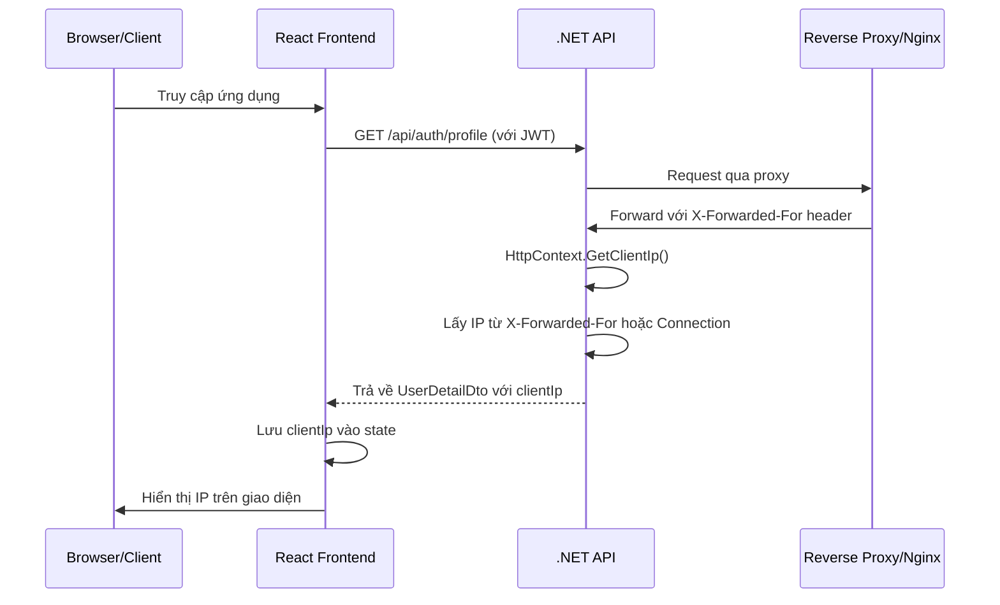

# Kế hoạch hiển thị IP Client

## Mục tiêu
Hiển thị địa chỉ IP của client (người dùng) khi họ truy cập vào hệ thống quản lý IP, ví dụ: "Bạn đang truy cập từ IP: 192.168.1.100"

## Phân tích

### Hiện trạng
- Hệ thống có API backend bằng .NET (C#)
- Frontend là React + TypeScript với Ant Design
- Authentication sử dụng JWT tokens
- Endpoint `/api/auth/profile` trả về thông tin user hiện tại

### Yêu cầu
1. Backend lấy IP của client khi request đến API
2. Trả về IP client trong response của `/api/auth/profile`
3. Frontend hiển thị IP client trên giao diện

## Thiết kế

### 1. Backend Changes

#### 1.1. Tạo Extension Method để lấy Client IP

Tạo file `IPManagement.API/Extensions/HttpContextExtensions.cs`:

```csharp
namespace IPManagement.API.Extensions
{
    public static class HttpContextExtensions
    {
        /// <summary>
        /// Lấy địa chỉ IP của client từ HttpContext
        /// Xử lý các trường hợp: proxy, load balancer, direct connection
        /// </summary>
        public static string GetClientIp(this HttpContext context)
        {
            if (context == null)
                return string.Empty;

            // Kiểm tra X-Forwarded-For header (cho proxy/load balancer)
            if (context.Request.Headers.TryGetValue("X-Forwarded-For", out var forwardedFor))
            {
                var ip = forwardedFor.ToString().Split(',')[0].Trim();
                if (IsValidIp(ip))
                    return ip;
            }

            // Kiểm tra X-Real-IP header
            if (context.Request.Headers.TryGetValue("X-Real-IP", out var realIp))
            {
                if (IsValidIp(realIp.ToString()))
                    return realIp.ToString();
            }

            // Lấy IP trực tiếp từ Connection
            var connectionIp = context.Connection.RemoteIpAddress?.ToString();
            if (!string.IsNullOrEmpty(connectionIp))
            {
                // Xử lý IPv6 localhost
                if (connectionIp == "::1")
                    return "127.0.0.1";
                return connectionIp;
            }

            return string.Empty;
        }

        private static bool IsValidIp(string ip)
        {
            if (string.IsNullOrEmpty(ip))
                return false;
            
            return System.Net.IPAddress.TryParse(ip.Split(',')[0].Trim(), out _);
        }
    }
}
```

#### 1.2. Cập nhật DTOs

**File: `IPManagement.API/DTOs/AuthDTOs.cs`**

Thêm field `clientIp` vào `LoginResponse`:

```csharp
public class LoginResponse
{
    public string Token { get; set; } = string.Empty;
    public string RefreshToken { get; set; } = string.Empty;
    public DateTime ExpiresAt { get; set; }
    public UserDto User { get; set; } = new();
    public string? ClientIp { get; set; }  // Thêm dòng này
}
```

**File: `IPManagement.API/DTOs/UserDTOs.cs`** (nếu có) hoặc thêm vào `AuthDTOs.cs`

Thêm field `clientIp` vào `UserDetailDto`:

```csharp
public class UserDetailDto
{
    public Guid Id { get; set; }
    public string Username { get; set; } = string.Empty;
    public string Email { get; set; } = string.Empty;
    public string? FullName { get; set; }
    public string? Phone { get; set; }
    public UserUnitDto[] Units { get; set; } = Array.Empty<UserUnitDto>();
    public string[] Roles { get; set; } = Array.Empty<string>();
    public string[] Permissions { get; set; } = Array.Empty<string>();
    public bool IsActive { get; set; }
    public DateTime CreatedAt { get; set; }
    public DateTime? UpdatedAt { get; set; }
    public DateTime? LastLogin { get; set; }
    public string? ClientIp { get; set; }  // Thêm dòng này
}
```

#### 1.3. Cập nhật AuthController

**File: `IPManagement.API/Controllers/AuthController.cs`**

Cập nhật method `GetProfile` để trả về client IP:

```csharp
[HttpGet("profile")]
[Authorize]
public async Task<ActionResult<UserDetailDto>> GetProfile()
{
    var userId = Guid.Parse(User.FindFirst(ClaimTypes.NameIdentifier)?.Value!);
    var user = await _authService.GetCurrentUserAsync(userId);
    if (user == null)
        return NotFound();

    // Thêm client IP vào response
    user.ClientIp = HttpContext.GetClientIp();

    return Ok(user);
}
```

#### 1.4. Cập nhật Program.cs (nếu cần)

Để hỗ trợ lấy IP đúng khi đứng sau proxy, thêm vào `Program.cs`:

```csharp
// Sau khi tạo builder
var builder = WebApplication.CreateBuilder(args);

// Thêm Forwarded Headers middleware
builder.Services.Configure<ForwardedHeadersOptions>(options =>
{
    options.ForwardedHeaders = ForwardedHeaders.XForwardedFor | ForwardedHeaders.XForwardedProto;
    options.KnownNetworks.Clear();
    options.KnownProxies.Clear();
});

var app = builder.Build();

// Sử dụng trước khi có authentication
app.UseForwardedHeaders();
```

### 2. Frontend Changes

#### 2.1. Cập nhật TypeScript Types

**File: `IPManagement.Web/src/types/auth.ts`**

```typescript
export interface User {
  id: string;
  username: string;
  email: string;
  fullName?: string;
  phone?: string;
  unitId?: number;
  unitName?: string;
  units?: UserUnit[];
  roles: string[];
  permissions?: string[];
  clientIp?: string;  // Thêm dòng này
}

export interface LoginResponse {
  token: string;
  refreshToken: string;
  expiresAt: string;
  user: User;
  clientIp?: string;  // Thêm dòng này
}
```

#### 2.2. Hiển thị IP Client trên giao diện

Có nhiều vị trí để hiển thị IP client:

**Option 1: Hiển thị trên Header/Navbar**

File: `IPManagement.Web/src/layouts/MainLayout.tsx`

```tsx
<div style={{ display: 'flex', alignItems: 'center', gap: 16 }}>
  <span>
    Xin chào, {authState.user?.fullName || authState.user?.username}
  </span>
  {authState.user?.clientIp && (
    <span style={{ fontSize: 12, color: '#666' }}>
      IP: {authState.user.clientIp}
    </span>
  )}
</div>
```

**Option 2: Hiển thị trên Dashboard**

File: `IPManagement.Web/src/pages/DashboardPage.tsx`

```tsx
<Card title="Thông tin phiên">
  <Descriptions bordered column={1}>
    <Descriptions.Item label="Người dùng">
      {authState.user?.fullName || authState.user?.username}
    </Descriptions.Item>
    <Descriptions.Item label="Email">{authState.user?.email}</Descriptions.Item>
    <Descriptions.Item label="IP Address">
      {authState.user?.clientIp || 'N/A'}
    </Descriptions.Item>
  </Descriptions>
</Card>
```

**Option 3: Hiển thị trên Settings Page**

File: `IPManagement.Web/src/pages/SettingsPage.tsx`

Thêm section "Thông tin phiên đăng nhập" với IP client.

## Mermaid Diagram - Flow



## Files cần sửa

### Backend
1. `IPManagement.API/Extensions/HttpContextExtensions.cs` - Tạo mới
2. `IPManagement.API/DTOs/AuthDTOs.cs` - Thêm field ClientIp
3. `IPManagement.API/Controllers/AuthController.cs` - Cập nhật GetProfile
4. `IPManagement.API/Program.cs` - Thêm Forwarded Headers (nếu cần)

### Frontend
1. `IPManagement.Web/src/types/auth.ts` - Thêm clientIp
2. `IPManagement.Web/src/layouts/MainLayout.tsx` - Hiển thị IP (Option 1)
3. HOẶC `IPManagement.Web/src/pages/DashboardPage.tsx` - Hiển thị IP (Option 2)

## Ưu tiên hiển thị

**Khuyến nghị: Hiển thị ở cả 2 vị trí**
1. **Header**: Hiển thị ngắn gọn "IP: x.x.x.x" để người dùng luôn thấy
2. **Dashboard**: Hiển thị chi tiết hơn trong card thông tin

## Lưu ý

1. **IPv6**: Xử lý IPv6 localhost (::1) thành 127.0.0.1
2. **Proxy**: Hỗ trợ X-Forwarded-For và X-Real-IP headers
3. **Security**: Không lưu IP vào database, chỉ trả về trong session hiện tại
4. **Privacy**: Hiển thị rõ ràng cho người dùng biết IP của họ đang được hiển thị

## Bước tiếp theo

Sau khi implement, có thể mở rộng:
- Lưu lịch sử đăng nhập với IP vào database
- Hiển thị vị trí địa lý dựa trên IP
- Cảnh báo khi có đăng nhập từ IP lạ