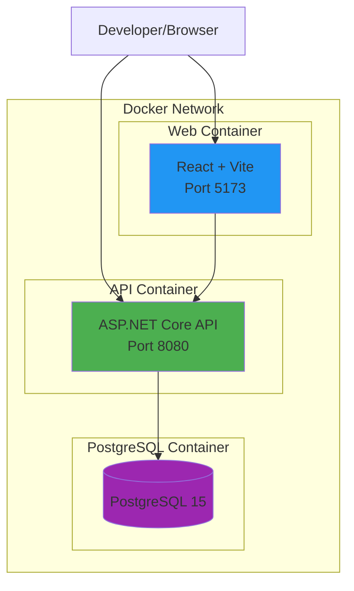

# Kế hoạch Containerize dự án IP Management với Docker

## Tổng quan

Kế hoạch này mô tả các bước để containerize dự án IP Management gồm:
- **Backend**: ASP.NET Core 9.0 API
- **Frontend**: React 19 + Vite 7 + TypeScript
- **Database**: PostgreSQL 15

## Architecture Diagram



## Files cần tạo

### 1. Dockerfile cho API (IPManagement.API/Dockerfile)

```dockerfile
# Stage 1: Build
FROM mcr.microsoft.com/dotnet/sdk:9.0 AS build
WORKDIR /src

# Copy project file and restore dependencies
COPY ["IPManagement.API/IPManagement.API.csproj", "IPManagement.API/"]
RUN dotnet restore "IPManagement.API/IPManagement.API.csproj"

# Copy source code and build
COPY . .
WORKDIR "/src/IPManagement.API"
RUN dotnet build "IPManagement.API.csproj" -c Release -o /app/build

# Stage 2: Publish
FROM build AS publish
RUN dotnet publish "IPManagement.API.csproj" -c Release -o /app/publish /p:UseAppHost=false

# Stage 3: Runtime
FROM mcr.microsoft.com/dotnet/aspnet:9.0 AS final
WORKDIR /app

# Create non-root user for security
RUN adduser --disabled-password --gecos '' appuser

# Expose port
EXPOSE 8080

# Set environment variables
ENV ASPNETCORE_URLS=http://+:8080
ENV ASPNETCORE_ENVIRONMENT=Production

# Copy published output
COPY --from=publish /app/publish .

# Switch to non-root user
USER appuser

ENTRYPOINT ["dotnet", "IPManagement.API.dll"]
```

### 2. Dockerfile cho Web (IPManagement.Web/Dockerfile)

```dockerfile
# Stage 1: Build
FROM node:20-alpine AS build
WORKDIR /app

# Copy package files
COPY package*.json ./

# Install dependencies
RUN npm ci

# Copy source code
COPY . .

# Build application
RUN npm run build

# Stage 2: Serve with nginx
FROM nginx:alpine AS production

# Copy built files
COPY --from=build /app/dist /usr/share/nginx/html

# Copy nginx config
COPY nginx.conf /etc/nginx/conf.d/default.conf

EXPOSE 80

CMD ["nginx", "-g", "daemon off;"]
```

### 3. Nginx config cho Web (IPManagement.Web/nginx.conf)

```nginx
server {
    listen 80;
    server_name localhost;
    root /usr/share/nginx/html;
    index index.html;

    # Handle SPA routing
    location / {
        try_files $uri $uri/ /index.html;
    }

    # Proxy API calls
    location /api {
        proxy_pass http://api:8080;
        proxy_http_version 1.1;
        proxy_set_header Upgrade $http_upgrade;
        proxy_set_header Connection 'upgrade';
        proxy_set_header Host $host;
        proxy_cache_bypass $http_upgrade;
    }

    # Cache static assets
    location ~* \.(js|css|png|jpg|jpeg|gif|ico|svg)$ {
        expires 1y;
        add_header Cache-Control "public, immutable";
    }
}
```

### 4. Dockerfile cho Development (IPManagement.Web/Dockerfile.dev)

```dockerfile
FROM node:20-alpine
WORKDIR /app

# Copy package files
COPY package*.json ./

# Install dependencies
RUN npm ci

# Copy source code
COPY . .

# Expose port
EXPOSE 5173

# Set environment variables
ENV VITE_API_URL=http://localhost:5000

# Start dev server with host binding
CMD ["npm", "run", "dev", "--", "--host"]
```

### 5. docker-compose.yml (root directory)

```yaml
version: '3.8'

services:
  # PostgreSQL Database
  postgres:
    image: postgres:15-alpine
    container_name: ipmanagement-db
    environment:
      POSTGRES_DB: IPManagementDB
      POSTGRES_USER: postgres
      POSTGRES_PASSWORD: ${POSTGRES_PASSWORD:-1Nguyen,}
    ports:
      - "5432:5432"
    volumes:
      - postgres_data:/var/lib/postgresql/data
      - ./scripts/init.sql:/docker-entrypoint-initdb.d/init.sql
    networks:
      - ipmanagement-network
    healthcheck:
      test: ["CMD-SHELL", "pg_isready -U postgres"]
      interval: 10s
      timeout: 5s
      retries: 5

  # ASP.NET Core API
  api:
    build:
      context: .
      dockerfile: IPManagement.API/Dockerfile
    container_name: ipmanagement-api
    environment:
      ConnectionStrings:DefaultConnection: "Host=postgres:5432;Database=IPManagementDB;Username=postgres;Password=${POSTGRES_PASSWORD:-1Nguyen,}"
      JwtSettings:SecretKey: ${JWT_SECRET_KEY:-your-256-bit-secret-key-must-be-long-enough}
      JwtSettings:Issuer: ${JWT_ISSUER:-IPManagementAPI}
      JwtSettings:Audience: ${JWT_AUDIENCE:-IPManagementClient}
      ASPNETCORE_ENVIRONMENT: ${ASPNETCORE_ENVIRONMENT:-Production}
    ports:
      - "5000:8080"
    depends_on:
      postgres:
        condition: service_healthy
    networks:
      - ipmanagement-network
    restart: unless-stopped

  # React Frontend
  web:
    build:
      context: ./IPManagement.Web
      dockerfile: Dockerfile
    container_name: ipmanagement-web
    ports:
      - "80:80"
    depends_on:
      - api
    networks:
      - ipmanagement-network
    restart: unless-stopped

  # Development Web Container (use with docker-compose -f docker-compose.dev.yml)
  web-dev:
    build:
      context: ./IPManagement.Web
      dockerfile: Dockerfile.dev
    container_name: ipmanagement-web-dev
    ports:
      - "5173:5173"
    volumes:
      - ./IPManagement.Web:/app
      - /app/node_modules
    environment:
      VITE_API_URL: http://localhost:5000
    depends_on:
      - api
    networks:
      - ipmanagement-network

networks:
  ipmanagement-network:
    driver: bridge

volumes:
  postgres_data:
```

### 6. docker-compose.dev.yml (Development override)

```yaml
version: '3.8'

services:
  web:
    extends:
      file: docker-compose.yml
      service: web-dev
    
  api:
    build:
      context: .
      dockerfile: IPManagement.API/Dockerfile.dev
    environment:
      ASPNETCORE_ENVIRONMENT: Development
      ASPNETCORE_URLS: http://+:8080
    volumes:
      - ./IPManagement.API:/app
      - /app/bin
    ports:
      - "5000:8080"
```

### 7. Dockerfile.dev cho API (IPManagement.API/Dockerfile.dev)

```dockerfile
FROM mcr.microsoft.com/dotnet/sdk:9.0 AS base
WORKDIR /src

# Expose port
EXPOSE 8080

# Set environment variables
ENV ASPNETCORE_URLS=http://+:8080
ENV ASPNETCORE_ENVIRONMENT=Development

# Copy source code
COPY . .

ENTRYPOINT ["dotnet", "run", "--project", "IPManagement.API.csproj"]
```

### 8. .dockerignore cho API (IPManagement.API/.dockerignore)

```
**/.git
**/.gitignore
**/.vs
**/.vscode
**/bin
**/obj
**/*.user
**/Dockerfile*
**/docker-compose*
**/.dockerignore
README.md
```

### 9. .dockerignore cho Web (IPManagement.Web/.dockerignore)

```
**/node_modules
**/dist
**/.git
**/.gitignore
**/.vscode
**/Dockerfile*
**/docker-compose*
**/.dockerignore
**/coverage
**/.eslintcache
README.md
```

### 10. .env.example (root directory)

```env
# PostgreSQL
POSTGRES_PASSWORD=1Nguyen,

# JWT Settings
JWT_SECRET_KEY=your-256-bit-secret-key-must-be-long-enough
JWT_ISSUER=IPManagementAPI
JWT_AUDIENCE=IPManagementClient

# Environment
ASPNETCORE_ENVIRONMENT=Production
```

### 11. scripts/init.sql (root directory)

```sql
-- Initialize database if needed
-- This runs on first container start
DO $$
BEGIN
    IF NOT EXISTS (SELECT FROM pg_database WHERE datname = 'IPManagementDB') THEN
        RAISE NOTICE 'Database already exists or will be created by EF Migrations';
    END IF;
END $$;
```

## Hướng dẫn sử dụng

### Development Mode

```bash
# Chạy toàn bộ stack cho development
docker-compose -f docker-compose.dev.yml up -d

# Xem logs
docker-compose logs -f api
docker-compose logs -f web

# Dừng services
docker-compose -f docker-compose.dev.yml down
```

### Production Mode

```bash
# Build và chạy cho production
docker-compose up -d

# Build lại images
docker-compose build --no-cache

# Xem logs
docker-compose logs -f

# Dừng services
docker-compose down

# Dừng và xóa volumes (cẩn thận!)
docker-compose down -v
```

### Development với hot reload

```bash
# API với hot reload
cd IPManagement.API
docker build -f Dockerfile.dev -t ipmanagement-api-dev .
docker run -p 5000:8080 -v $(pwd):/app ipmanagement-api-dev

# Web với hot reload
cd IPManagement.Web
docker build -f Dockerfile.dev -t ipmanagement-web-dev .
docker run -p 5173:5173 -v $(pwd):/app ipmanagement-web-dev
```

## Migration Database

```bash
# Chạy migrations trong container
docker-compose exec api dotnet ef database update

# Tạo migration mới
docker-compose exec api dotnet ef migrations add MigrationName
```

## Troubleshooting

### Kiểm tra container status
```bash
docker-compose ps
```

### Xem logs
```bash
docker-compose logs api
docker-compose logs web
docker-compose logs postgres
```

### Restart services
```bash
docker-compose restart api
docker-compose restart web
```

###进入 container
```bash
docker exec -it ipmanagement-api bash
docker exec -it ipmanagement-web sh
```

## Benefits Summary

| Benefit | Description |
|---------|-------------|
| Consistency | Nhất quán giữa dev, staging, production |
| Isolation | Không xung đột dependencies |
| Simplicity | `docker-compose up` để chạy toàn bộ |
| Scalability | Dễ dàng scale với `--scale` flag |
| Portability | Chạy trên bất kỳ đâu có Docker |
| Security | Cô lập services, non-root user |
| CI/CD | Tích hợp mượt với pipeline |
| Development | Hot reload, dễ debug |

## Next Steps

Để implement kế hoạch này, cần switch sang Code mode để:
1. Tạo tất cả Dockerfiles
2. Tạo docker-compose.yml
3. Tạo nginx.conf
4. Tạo .dockerignore files
5. Tạo .env.example
6. Viết README.md hướng dẫn chi tiết