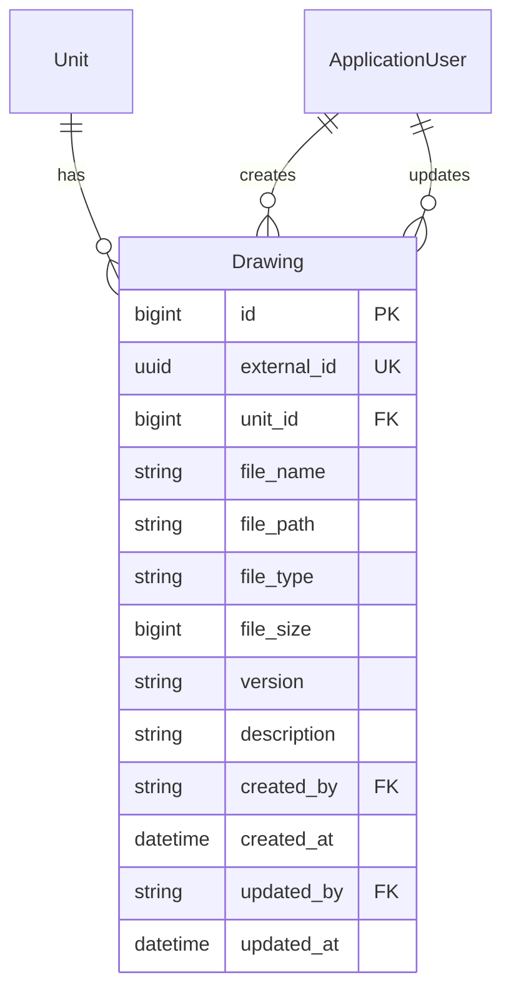
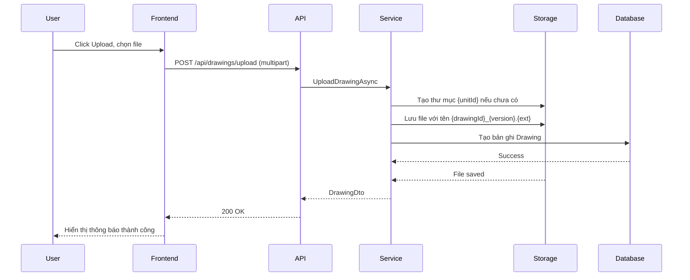
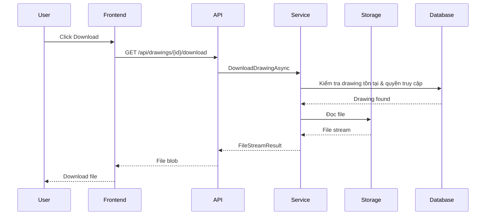
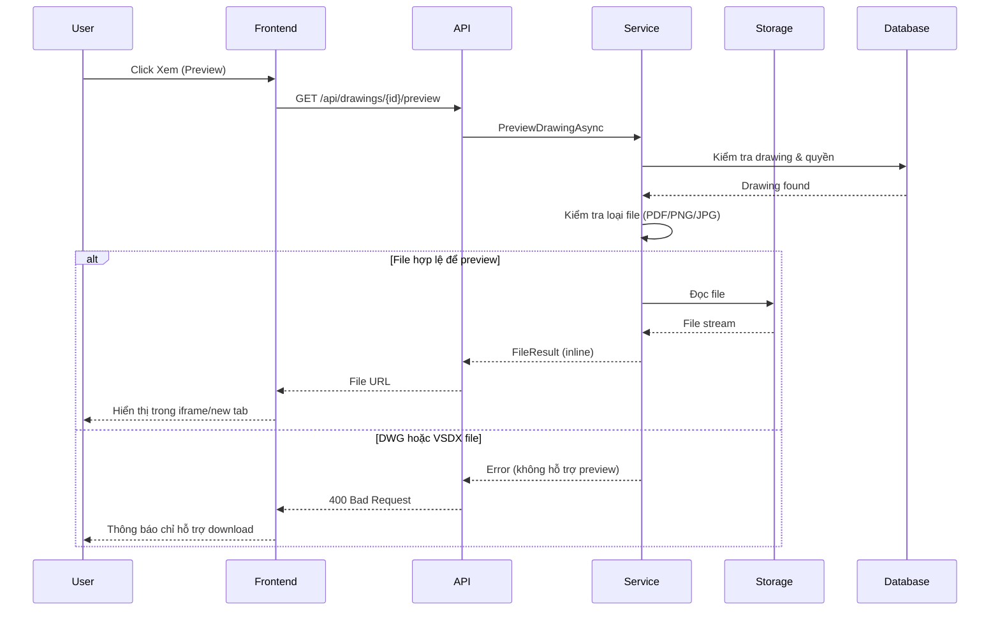

# Kế hoạch tính năng: Quản lý bản vẽ đơn vị

## Tổng quan

Tính năng này cho phép quản lý các bản vẽ (PDF, DWG, PNG, JPG) gắn với từng đơn vị. Mỗi đơn vị sẽ có một thư mục riêng để lưu trữ bản vẽ và có thể có nhiều bản vẽ.

## Yêu cầu chức năng

### 1. Quản lý bản vẽ
- **Tạo mới**: Upload bản vẽ mới cho đơn vị
- **Xem danh sách**: Hiển thị tất cả bản vẽ của đơn vị
- **Xem chi tiết**: Xem thông tin và preview bản vẽ
- **Cập nhật**: Sửa thông tin bản vẽ, upload file mới
- **Xóa**: Xóa bản vẽ (bao gồm file vật lý)

### 2. Upload
- Upload nhiều file cùng lúc (batch upload)
- Hỗ trợ định dạng: PDF, DWG, PNG, JPG, VSDX
- Kiểm tra kích thước file tối đa
- Hiển thị tiến trình upload

### 3. Download & Preview
- Download file bản vẽ
- Preview file PDF, PNG, JPG trực tiếp trên trình duyệt
- DWG và VSDX files sẽ chỉ hỗ trợ download (cần phần mềm chuyên dụng để xem)

### 4. Thông tin bản vẽ
- Tên bản vẽ
- Mô tả
- Phiên bản
- Định dạng file
- Kích thước file
- Ngày tạo / Ngày cập nhật
- Người tạo / Người cập nhật

## Kiến trúc hệ thống

### 1. Cấu trúc thư mục lưu trữ

```
uploads/
└── drawings/
    └── {unitId}/
        ├── {drawingId}_v1.pdf
        ├── {drawingId}_v2.pdf
        └── {drawingId}_image.png
```

**Lưu ý**: Sử dụng `unitId` thay vì tên đơn vị để tránh vấn đề với ký tự đặc biệt và để dễ dàng quản lý khi tên đơn vị thay đổi.

### 2. Database Schema



### 3. API Endpoints

```mermaid
graph TD
    A[Client] --> B[GET /api/drawings]
    A --> B1[GET /api/drawings/unit/{unitId}]
    A --> C[POST /api/drawings/upload]
    A --> D[GET /api/drawings/{id}]
    A --> E[PUT /api/drawings/{id}]
    A --> F[DELETE /api/drawings/{id}]
    A --> G[GET /api/drawings/{id}/download]
    A --> H[GET /api/drawings/{id}/preview]
    
    style B fill:#e1f5ff
    style C fill:#fff4e1
    style D fill:#e1f5ff
    style E fill:#fff4e1
    style F fill:#ffe1e1
    style G fill:#e1f5ff
    style H fill:#e1f5ff
```

## Chi tiết thiết kế

### Backend

#### 1. Model - Drawing

```csharp
public class Drawing
{
    public long Id { get; set; }
    public Guid ExternalId { get; set; }
    
    // Quan hệ với Unit
    public long UnitId { get; set; }
    public Unit? Unit { get; set; }
    
    // Thông tin file
    public string FileName { get; set; }
    public string FilePath { get; set; }
    public string FileType { get; set; }  // PDF, DWG, PNG, JPG, VSDX
    public long FileSize { get; set; }    // bytes
    
    // Thông tin bản vẽ
    public string? Version { get; set; }  // VD: "1.0", "2.0"
    public string? Description { get; set; }
    
    // Audit
    public string? CreatedBy { get; set; }
    public ApplicationUser? CreatedByUser { get; set; }
    public DateTime CreatedAt { get; set; }
    
    public string? UpdatedBy { get; set; }
    public ApplicationUser? UpdatedByUser { get; set; }
    public DateTime? UpdatedAt { get; set; }
}
```

#### 2. DTOs

**DrawingDTOs.cs**

```csharp
// Tạo mới (upload)
public class DrawingUploadRequest
{
    public long UnitId { get; set; }
    public string? Version { get; set; }
    public string? Description { get; set; }
}

// Response
public class DrawingDto
{
    public long Id { get; set; }
    public Guid ExternalId { get; set; }
    public long UnitId { get; set; }
    public string UnitName { get; set; }
    public string FileName { get; set; }
    public string FileType { get; set; }
    public long FileSize { get; set; }
    public string? Version { get; set; }
    public string? Description { get; set; }
    public string? CreatedBy { get; set; }
    public DateTime CreatedAt { get; set; }
    public string? UpdatedBy { get; set; }
    public DateTime? UpdatedAt { get; set; }
    public string? PreviewUrl { get; set; }  // Cho PDF, PNG, JPG
}

// Cập nhật thông tin
public class DrawingUpdateRequest
{
    public string? Version { get; set; }
    public string? Description { get; set; }
}

// Upload file mới cho bản vẽ đã tồn tại
public class DrawingFileUpdateRequest
{
    public long DrawingId { get; set; }
    public string? Version { get; set; }
}
```

#### 3. Service Interface

```csharp
public interface IDrawingService
{
    Task<DrawingDto[]> GetAllDrawingsAsync(Guid userId);
    Task<DrawingDto[]> GetDrawingsByUnitAsync(Guid userId, long unitId);
    Task<DrawingDto?> GetDrawingByIdAsync(Guid userId, long drawingId);
    Task<DrawingDto> UploadDrawingAsync(Guid userId, DrawingUploadRequest request, IFormFile file);
    Task<DrawingDto> UpdateDrawingAsync(Guid userId, long drawingId, DrawingUpdateRequest request);
    Task<DrawingDto> UpdateDrawingFileAsync(Guid userId, long drawingId, IFormFile file, string? version);
    Task<bool> DeleteDrawingAsync(Guid userId, long drawingId);
    Task<FileStreamResult> DownloadDrawingAsync(Guid userId, long drawingId);
    Task<FileResult> PreviewDrawingAsync(Guid userId, long drawingId);
}
```

#### 4. Permission Codes

Thêm vào `FunctionCode.cs`:
```csharp
DRAWING  // Quản lý bản vẽ
```

Thêm vào `CommandCode.cs` (đã có sẵn):
```csharp
VIEW, CREATE, UPDATE, DELETE  // Áp dụng cho DRAWING
```

#### 5. File Storage Configuration

```csharp
// appsettings.json
{
  "FileStorage": {
    "DrawingUploadPath": "uploads/drawings",
    "MaxFileSize": 52428800,  // 50MB
    "AllowedExtensions": [".pdf", ".dwg", ".png", ".jpg", ".jpeg", ".vsdx"]
  }
}
```

### Frontend

#### 1. Types - drawing.ts

```typescript
export interface Drawing {
  id: number;
  externalId: string;
  unitId: number;
  unitName: string;
  fileName: string;
  fileType: string;  // PDF, DWG, PNG, JPG, VSDX
  fileSize: number;
  version?: string;
  description?: string;
  createdBy?: string;
  createdAt: string;
  updatedBy?: string;
  updatedAt?: string;
  previewUrl?: string;
}

export interface DrawingUploadRequest {
  unitId: number;
  version?: string;
  description?: string;
}

export interface DrawingUpdateRequest {
  version?: string;
  description?: string;
}
```

#### 2. Service - drawing.service.ts

```typescript
import api from './api';
import type { Drawing, DrawingUploadRequest, DrawingUpdateRequest } from '../types/drawing';

export const drawingService = {
  // Lấy danh sách bản vẽ của đơn vị
  getDrawingsByUnit: async (unitId: number): Promise<Drawing[]> => {
    const response = await api.get<Drawing[]>(`/drawings/unit/${unitId}`);
    return response.data;
  },

  // Upload bản vẽ mới
  uploadDrawing: async (data: FormData): Promise<Drawing> => {
    const response = await api.post<Drawing>('/drawings/upload', data, {
      headers: { 'Content-Type': 'multipart/form-data' }
    });
    return response.data;
  },

  // Cập nhật thông tin
  updateDrawing: async (id: number, data: DrawingUpdateRequest): Promise<Drawing> => {
    const response = await api.put<Drawing>(`/drawings/${id}`, data);
    return response.data;
  },

  // Cập nhật file
  updateDrawingFile: async (id: number, file: File, version?: string): Promise<Drawing> => {
    const formData = new FormData();
    formData.append('file', file);
    if (version) formData.append('version', version);
    const response = await api.post<Drawing>(`/drawings/${id}/file`, formData, {
      headers: { 'Content-Type': 'multipart/form-data' }
    });
    return response.data;
  },

  // Xóa bản vẽ
  deleteDrawing: async (id: number): Promise<void> => {
    await api.delete(`/drawings/${id}`);
  },

  // Download file
  downloadDrawing: async (id: number, fileName: string): Promise<void> => {
    const response = await api.get(`/drawings/${id}/download`, {
      responseType: 'blob'
    });
    const blob = new Blob([response.data]);
    const url = window.URL.createObjectURL(blob);
    const link = document.createElement('a');
    link.href = url;
    link.download = fileName;
    link.click();
    window.URL.revokeObjectURL(url);
  },

  // Lấy URL preview
  getPreviewUrl: async (id: number): Promise<string> => {
    const response = await api.get(`/drawings/${id}/preview`);
    return response.data.previewUrl;
  }
};
```

#### 3. Component - DrawingManagement.tsx

```tsx
import { useState, useEffect } from 'react';
import { Table, Button, Modal, Form, Input, message, Space, Tag, Typography, Card } from 'antd';
import { UploadOutlined, DownloadOutlined, EyeOutlined, DeleteOutlined, EditOutlined } from '@ant-design/icons';
import type { Drawing, DrawingUploadRequest, DrawingUpdateRequest } from '../types/drawing';
import { drawingService } from '../services/drawing.service';

const { Title } = Typography;

interface DrawingManagementProps {
  unitId: number;
  unitName: string;
  canCreate: boolean;
  canUpdate: boolean;
  canDelete: boolean;
}

const DrawingManagement: React.FC<DrawingManagementProps> = ({
  unitId,
  unitName,
  canCreate,
  canUpdate,
  canDelete
}) => {
  const [drawings, setDrawings] = useState<Drawing[]>([]);
  const [loading, setLoading] = useState(false);
  const [uploadModalVisible, setUploadModalVisible] = useState(false);
  const [editModalVisible, setEditModalVisible] = useState(false);
  const [editingDrawing, setEditingDrawing] = useState<Drawing | null>(null);
  const [uploadForm] = Form.useForm();
  const [editForm] = Form.useForm();

  // Fetch drawings
  const fetchDrawings = async () => {
    setLoading(true);
    try {
      const data = await drawingService.getDrawingsByUnit(unitId);
      setDrawings(data);
    } catch (error) {
      message.error('Không thể tải danh sách bản vẽ');
    } finally {
      setLoading(false);
    }
  };

  useEffect(() => {
    fetchDrawings();
  }, [unitId]);

  // Handle upload
  const handleUpload = async (values: DrawingUploadRequest) => {
    const file = uploadForm.getFieldValue('file');
    if (!file || file.length === 0) {
      message.error('Vui lòng chọn file');
      return;
    }

    const formData = new FormData();
    formData.append('unitId', unitId.toString());
    formData.append('file', file[0]);
    if (values.version) formData.append('version', values.version);
    if (values.description) formData.append('description', values.description);

    try {
      await drawingService.uploadDrawing(formData);
      message.success('Upload bản vẽ thành công');
      setUploadModalVisible(false);
      uploadForm.resetFields();
      fetchDrawings();
    } catch (error) {
      message.error('Upload bản vẽ thất bại');
    }
  };

  // Handle delete
  const handleDelete = async (id: number) => {
    try {
      await drawingService.deleteDrawing(id);
      message.success('Xóa bản vẽ thành công');
      fetchDrawings();
    } catch (error) {
      message.error('Xóa bản vẽ thất bại');
    }
  };

  // Format file size
  const formatFileSize = (bytes: number) => {
    if (bytes < 1024) return bytes + ' B';
    if (bytes < 1024 * 1024) return (bytes / 1024).toFixed(2) + ' KB';
    return (bytes / (1024 * 1024)).toFixed(2) + ' MB';
  };

  // Get file icon/type
  const getFileTag = (fileType: string) => {
    const colors: Record<string, string> = {
      PDF: 'red',
      DWG: 'blue',
      PNG: 'green',
      JPG: 'orange',
      VSDX: 'purple'
    };
    return <Tag color={colors[fileType] || 'default'}>{fileType}</Tag>;
  };

  const columns = [
    {
      title: 'Tên file',
      dataIndex: 'fileName',
      key: 'fileName'
    },
    {
      title: 'Loại',
      dataIndex: 'fileType',
      key: 'fileType',
      render: (fileType: string) => getFileTag(fileType)
    },
    {
      title: 'Kích thước',
      dataIndex: 'fileSize',
      key: 'fileSize',
      render: (size: number) => formatFileSize(size)
    },
    {
      title: 'Phiên bản',
      dataIndex: 'version',
      key: 'version'
    },
    {
      title: 'Mô tả',
      dataIndex: 'description',
      key: 'description',
      ellipsis: true
    },
    {
      title: 'Ngày tạo',
      dataIndex: 'createdAt',
      key: 'createdAt',
      render: (date: string) => new Date(date).toLocaleDateString('vi-VN')
    },
      {
      title: 'Thao tác',
      key: 'actions',
      render: (_: any, record: Drawing) => (
        <Space>
          {record.fileType !== 'DWG' && record.fileType !== 'VSDX' && (
            <Button
              type="link"
              icon={<EyeOutlined />}
              onClick={() => window.open(record.previewUrl, '_blank')}
            >
              Xem
            </Button>
          )}
          <Button
            type="link"
            icon={<DownloadOutlined />}
            onClick={() => drawingService.downloadDrawing(record.id, record.fileName)}
          >
            Tải
          </Button>
          {canUpdate && (
            <Button
              type="link"
              icon={<EditOutlined />}
              onClick={() => {
                setEditingDrawing(record);
                editForm.setFieldsValue({
                  version: record.version,
                  description: record.description
                });
                setEditModalVisible(true);
              }}
            >
              Sửa
            </Button>
          )}
          {canDelete && (
            <Popconfirm
              title="Xóa bản vẽ"
              description="Bạn có chắc chắn muốn xóa bản vẽ này?"
              onConfirm={() => handleDelete(record.id)}
              okText="Có"
              cancelText="Không"
            >
              <Button type="link" danger icon={<DeleteOutlined />}>
                Xóa
              </Button>
            </Popconfirm>
          )}
        </Space>
      )
    }
  ];

  return (
    <Card title="Quản lý bản vẽ">
      <div style={{ marginBottom: 16 }}>
        {canCreate && (
          <Button
            type="primary"
            icon={<UploadOutlined />}
            onClick={() => setUploadModalVisible(true)}
          >
            Upload bản vẽ
          </Button>
        )}
      </div>

      <Table
        columns={columns}
        dataSource={drawings}
        rowKey="id"
        loading={loading}
        pagination={{ pageSize: 10 }}
      />

      {/* Upload Modal */}
      <Modal
        title="Upload bản vẽ mới"
        open={uploadModalVisible}
        onCancel={() => {
          setUploadModalVisible(false);
          uploadForm.resetFields();
        }}
        onOk={() => uploadForm.submit()}
        okText="Upload"
        cancelText="Hủy"
      >
        <Form form={uploadForm} onFinish={handleUpload} layout="vertical">
          <Form.Item
            name="file"
            label="File bản vẽ"
            rules={[{ required: true, message: 'Vui lòng chọn file' }]}
          >
            <Input.TypePicker
              accept=".pdf,.dwg,.png,.jpg,.jpeg,.vsdx"
              multiple
              maxCount={1}
            />
          </Form.Item>
          <Form.Item name="version" label="Phiên bản">
            <Input placeholder="VD: 1.0" />
          </Form.Item>
          <Form.Item name="description" label="Mô tả">
            <Input.TextArea rows={3} />
          </Form.Item>
        </Form>
      </Modal>

      {/* Edit Modal */}
      <Modal
        title="Cập nhật thông tin bản vẽ"
        open={editModalVisible}
        onCancel={() => {
          setEditModalVisible(false);
          setEditingDrawing(null);
        }}
        onOk={() => editForm.submit()}
        okText="Lưu"
        cancelText="Hủy"
      >
        <Form form={editForm} layout="vertical">
          <Form.Item name="version" label="Phiên bản">
            <Input placeholder="VD: 1.0" />
          </Form.Item>
          <Form.Item name="description" label="Mô tả">
            <Input.TextArea rows={3} />
          </Form.Item>
        </Form>
      </Modal>
    </Card>
  );
};

export default DrawingManagement;
```

#### 4. Tích hợp vào UnitDetailPage

Thêm component `DrawingManagement` vào cuối `UnitDetailPage`, sau phần quản lý IP addresses.

## Workflow

### 1. Upload bản vẽ



### 2. Download bản vẽ



### 3. Preview bản vẽ



## Bảo mật

### 1. Kiểm tra quyền

- Người dùng cần có `FunctionCode.DRAWING` + `CommandCode.VIEW` để xem danh sách
- `CommandCode.CREATE` để upload
- `CommandCode.UPDATE` để sửa
- `CommandCode.DELETE` để xóa

### 2. Kiểm tra quyền truy cập đơn vị

- Người dùng phải được gán vào đơn vị (hoặc là Admin) mới có thể quản lý bản vẽ của đơn vị đó

### 3. Validate file

- Kiểm tra extension file
- Kiểm tra kích thước file (tối đa 50MB)
- Kiểm tra MIME type

### 4. Path traversal protection

- Sử dụng `unitId` thay vì tên đơn vị cho đường dẫn thư mục
- Validate và sanitize file name
- Sử dụng `Path.GetFullPath()` để đảm bảo path hợp lệ

## Cấu hình

### 1. Backend - appsettings.json

```json
{
  "FileStorage": {
    "DrawingUploadPath": "uploads/drawings",
    "MaxFileSize": 52428800,
    "AllowedExtensions": [".pdf", ".dwg", ".png", ".jpg", ".jpeg", ".vsdx"]
  }
}
```

### 2. Nginx configuration

Thêm location block cho file uploads:

```nginx
location /uploads/drawings/ {
    alias /app/uploads/drawings/;
    expires 30d;
    add_header Cache-Control "public, immutable";
    
    # Giới hạn kích thước request cho upload
    client_max_body_size 50M;
}
```

### 3. Docker volume

```yaml
# docker-compose.yml
services:
  ipmanagement-api:
    volumes:
      - ./uploads:/app/uploads
```

## Migration Plan

### Database Migration

```sql
CREATE TABLE Drawings (
    Id BIGINT PRIMARY KEY GENERATED BY DEFAULT AS IDENTITY,
    ExternalId UUID NOT NULL DEFAULT gen_random_uuid(),
    UnitId BIGINT NOT NULL REFERENCES Units(Id) ON DELETE CASCADE,
    FileName VARCHAR(255) NOT NULL,
    FilePath VARCHAR(500) NOT NULL,
    FileType VARCHAR(10) NOT NULL,
    FileSize BIGINT NOT NULL,
    Version VARCHAR(50),
    Description VARCHAR(1000),
    CreatedBy VARCHAR(450),
    CreatedAt TIMESTAMP NOT NULL DEFAULT UTC_TIMESTAMP(),
    UpdatedBy VARCHAR(450),
    UpdatedAt TIMESTAMP,
    CONSTRAINT FK_Drawings_Units FOREIGN KEY (UnitId) REFERENCES Units(Id),
    CONSTRAINT FK_Drawings_AspNetUsers_Created FOREIGN KEY (CreatedBy) REFERENCES AspNetUsers(Id),
    CONSTRAINT FK_Drawings_AspNetUsers_Updated FOREIGN KEY (UpdatedBy) REFERENCES AspNetUsers(Id)
);

CREATE INDEX IX_Drawings_UnitId ON Drawings(UnitId);
CREATE INDEX IX_Drawings_FileType ON Drawings(FileType);
```

## Testing Checklist

- [ ] Upload file hợp lệ (PDF, DWG, PNG, JPG)
- [ ] Upload file vượt quá kích thước tối đa
- [ ] Upload file với extension không được phép
- [ ] Upload file .vsdx
- [ ] Xem danh sách bản vẽ của đơn vị
- [ ] Xem danh sách khi không có quyền (phải bị từ chối)
- [ ] Download file
- [ ] Preview PDF/PNG/JPG
- [ ] Preview DWG (phải báo lỗi)
- [ ] Preview VSDX (phải báo lỗi)
- [ ] Cập nhật thông tin bản vẽ
- [ ] Upload file mới cho bản vẽ đã tồn tại
- [ ] Xóa bản vẽ (kiểm tra file vật lý cũng bị xóa)
- [ ] Xóa đơn vị (kiểm tra bản vẽ cũng bị xóa cascade)

## Timeline triển khai

1. **Backend**
   - Tạo Model và DTOs
   - Tạo Database migration
   - Implement Service
   - Tạo Controller
   - Configure file storage
   - Add permissions

2. **Frontend**
   - Tạo types
   - Tạo service
   - Tạo component
   - Tích hợp vào UnitDetailPage

3. **Testing & Deployment**
   - Unit testing
   - Integration testing
   - Configure nginx
   - Setup storage volume