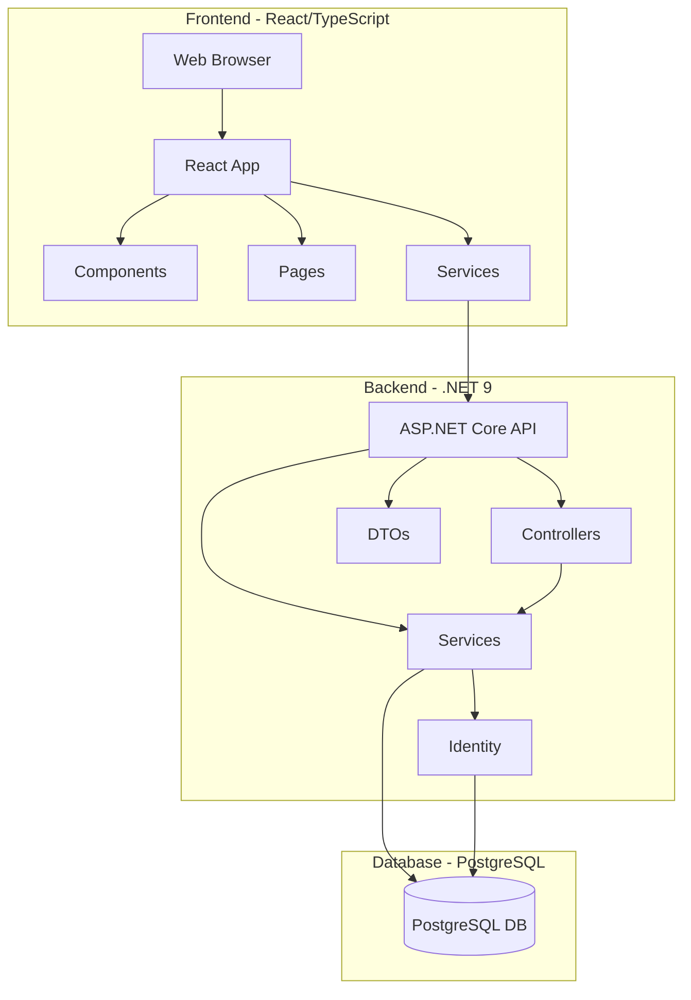
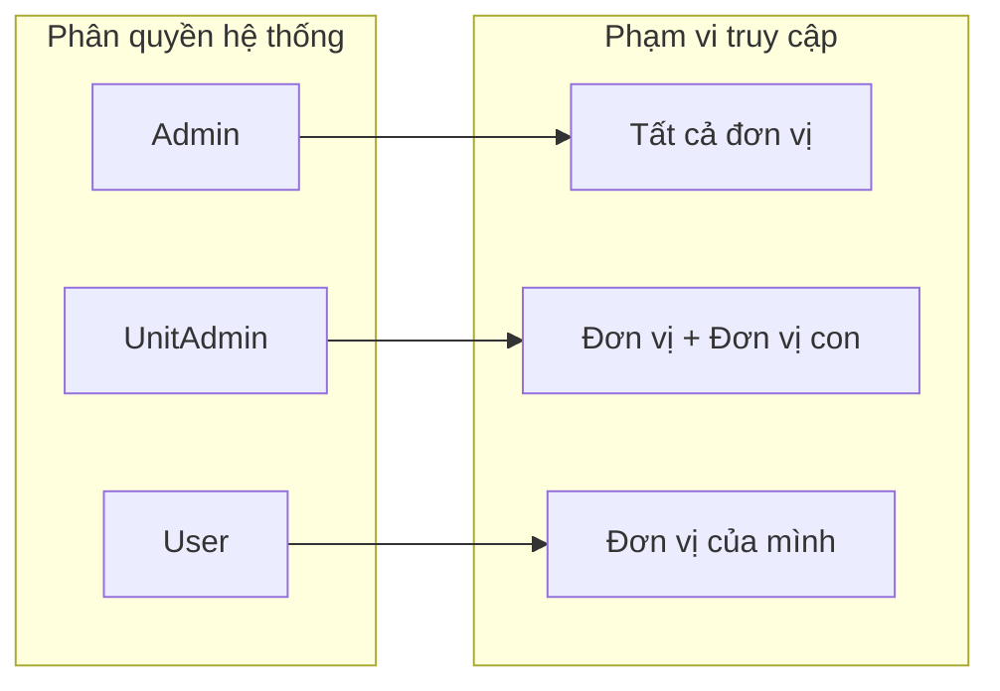
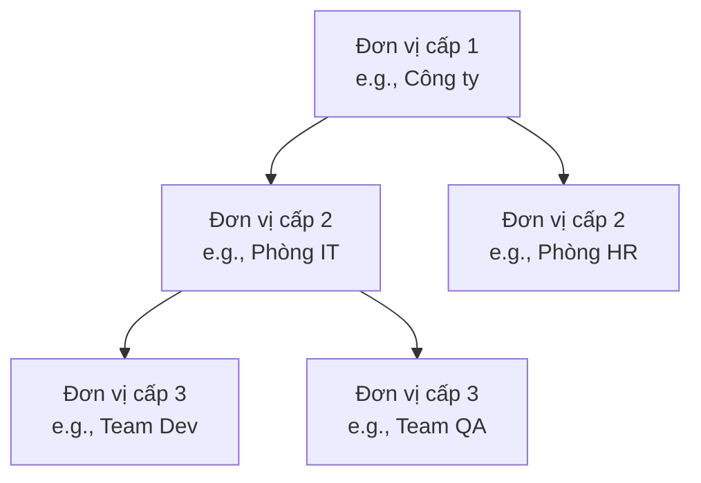
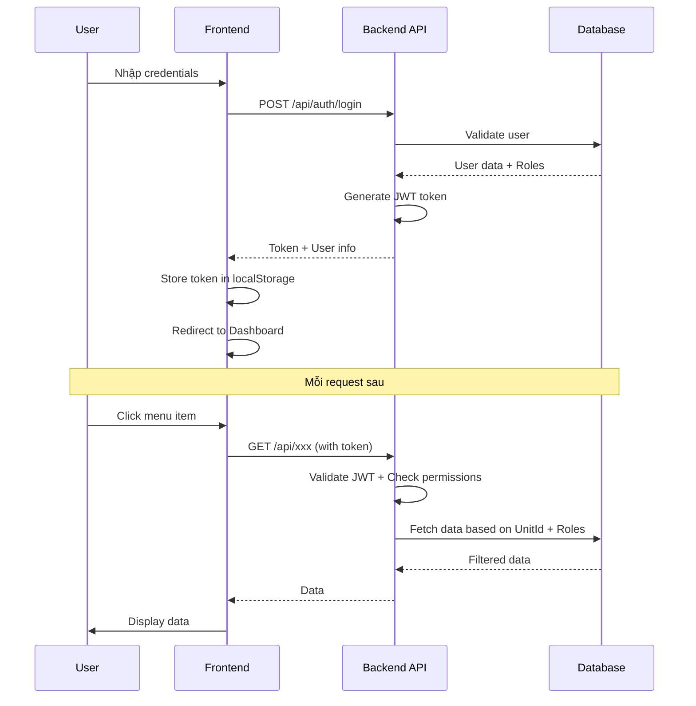
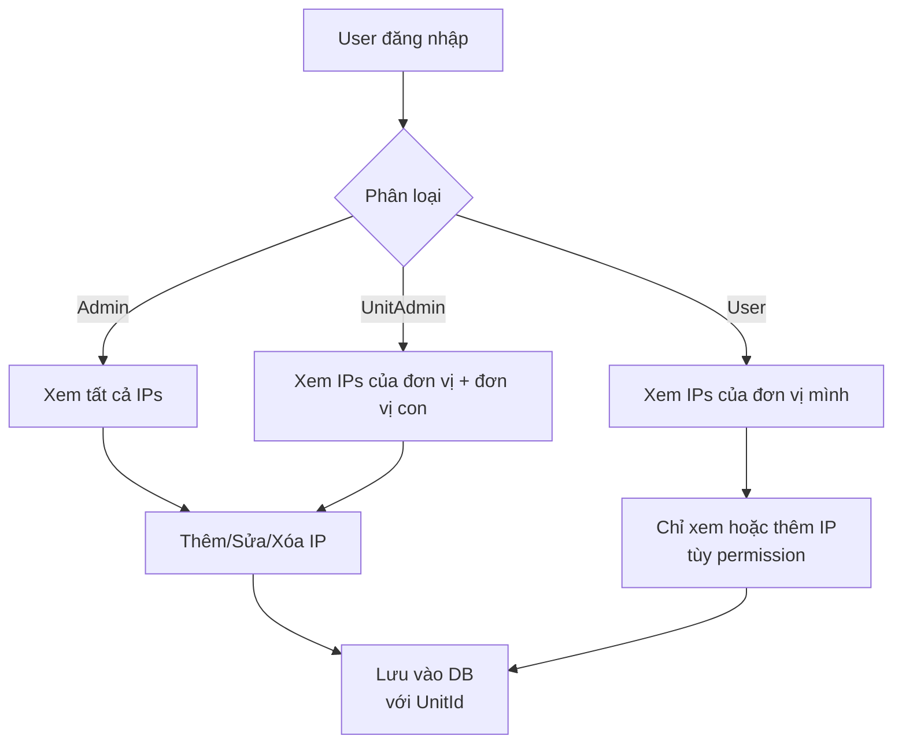
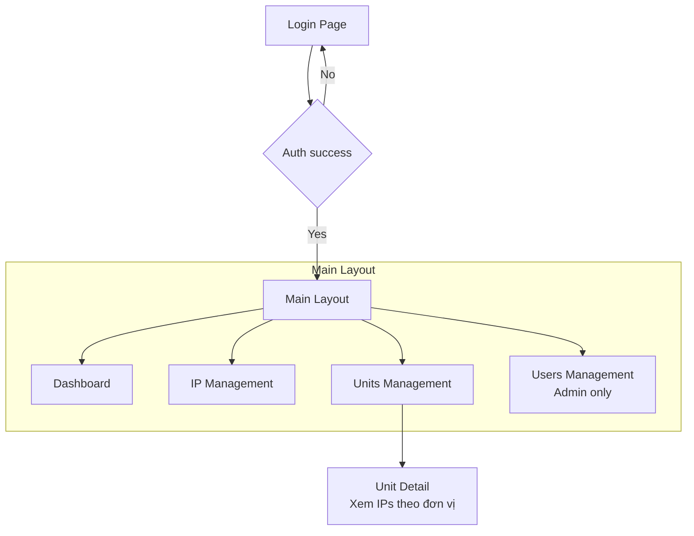

# Kiến trúc hệ thống Quản lý IP

## 1. Tổng quan hệ thống



---

## 2. Mô hình dữ liệu chính

```mermaid
erDiagram
    ApplicationUser {
        Guid Id PK
        string Username
        string Email
        string FullName
        string Phone
        long? UnitId FK
        bool IsActive
        DateTime CreatedAt
        DateTime? LastLogin
    }
    
    Unit {
        long Id PK
        Guid ExternalId
        string Name
        string? Code
        long? ParentUnitId FK
        string? Description
        string? Note
        bool IsActive
        DateTime CreatedAt
    }
    
    IPAddressRecord {
        long Id PK
        Guid ExternalId
        long UnitId FK
        string IPAddress
        string? MACAddress
        string? DeviceName
        string? DeviceType
        string? Port
        string Status
        string? Description
        DateTime CreatedAt
    }
    
    AuditLog {
        long Id PK
        Guid UserId FK
        long? IPAddressId FK
        string Action
        string? OldValue
        string? NewValue
        DateTime CreatedAt
    }
    
    ApplicationUser }|--|| Unit : "belongs to"
    Unit ||--o{ ApplicationUser : "has users"
    Unit ||--o{ Unit : "parent-child"
    Unit ||--o{ IPAddressRecord : "has IPs"
    Unit ||--o{ AuditLog : "logs"
    ApplicationUser ||--o{ AuditLog : "creates"
    ApplicationUser ||--o{ IPAddressRecord : "creates/updates"
```

---

## 3. Phân quyền và Role



### Chi tiết phân quyền:

| Role | Quản lý Users | Quản lý Đơn vị | Quản lý IP | Xem báo cáo |
|------|--------------|----------------|------------|-------------|
| **Admin** | ✅ Toàn hệ thống | ✅ Toàn hệ thống | ✅ Toàn hệ thống | ✅ Tất cả |
| **UnitAdmin** | ❌ | ✅ Đơn vị + con | ✅ Đơn vị + con | ✅ Đơn vị + con |
| **User** | ❌ | ❌ | ✅ Đơn vị của mình | ✅ Đơn vị của mình |

---

## 4. Cây đơn vị (Unit Hierarchy)



### Đặc điểm:
- **Không giới hạn số cấp** (có thể có cấp 1, 2, 3, ...)
- **Mỗi đơn vị chỉ có 1 đơn vị cha** (ParentUnitId)
- **UnitAdmin** của đơn vị cấp trên có quyền quản lý tất cả đơn vị con

---

## 5. Luồng đăng nhập và phân quyền



---

## 6. Luồng quản lý IP theo đơn vị



---

## 7. Các API chính

```mermaid
graph TB
    subgraph "Authentication"
        A1[POST /api/auth/login]
        A2[POST /api/auth/register]
        A3[POST /api/auth/refresh]
    end
    
    subgraph "Users"
        U1[GET /api/users]
        U2[POST /api/users]
        U3[PUT /api/users/{id}]
        U4[DELETE /api/users/{id}]
    end
    
    subgraph "Units"
        UN1[GET /api/units]
        UN2[GET /api/units/tree]
        UN3[POST /api/units]
        UN4[PUT /api/units/{id}]
        UN5[DELETE /api/units/{id}]
    end
    
    subgraph "IP Addresses"
        I1[GET /api/ip-addresses]
        I2[POST /api/ip-addresses]
        I3[PUT /api/ip-addresses/{id}]
        I4[DELETE /api/ip-addresses/{id}]
        I5[GET /api/ip-addresses/check-status]
    end
    
    subgraph "Audit Logs"
        L1[GET /api/audit-logs]
    end
```

---

## 8. Frontend Pages



---

## 9. Tóm tắt kiến trúc

| Thành phần | Công nghệ | Mô tả |
|-----------|----------|-------|
| **Frontend** | React 19, TypeScript, Ant Design | SPA với routing, Redux store |
| **Backend** | .NET 9, ASP.NET Core | REST API, JWT authentication |
| **Database** | PostgreSQL | Entity Framework Core |
| **Authentication** | ASP.NET Core Identity | JWT tokens, Roles |
| **Authorization** | Custom policy + UnitId | Phân quyền theo role và đơn vị |

---

## 10. Điểm mạnh của kiến trúc hiện tại

1. **Đơn giản**: Mỗi user thuộc 1 đơn vị, dễ quản lý
2. **Linh hoạt**: Role bổ sung phân quyền chi tiết
3. **Mở rộng**: Cây đơn vị không giới hạn số cấp
4. **Bảo mật**: JWT + phân quyền ở cả frontend và backend
5. **Audit**: Ghi log mọi thay đổi quan trọng