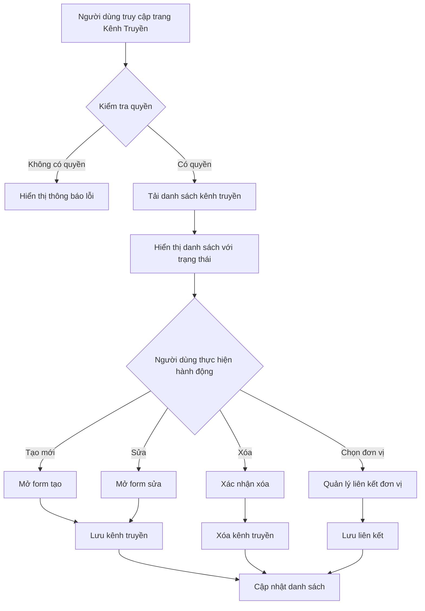

# Kế hoạch triển khai tính năng Quản lý Kênh Truyền

## Tổng quan

Tính năng quản lý kênh truyền (Transmission Channel) cho phép quản lý các thuê bao riêng mà đơn vị thuê từ nhà mạng, với thông tin bao gồm VLAN ID, dải IP (range), subnet, gateway, và liên kết nhiều-nhiều với các đơn vị.

## Yêu cầu chức năng

### Thông tin kênh truyền
- **Mã kênh**: Mã định danh duy nhất
- **Nhà mạng**: VNPT, FPT, Viettel, hoặc nhà mạng khác
- **Băng thông**: Tốc độ đường truyền (Mbps)
- **VLAN ID**: Định danh VLAN
- **Dải IP**: Khoảng IP từ IP bắt đầu đến IP kết thúc (ví dụ: 10.97.5.5-10.97.5.254)
- **Subnet**: Mask subnet
- **Gateway**: Default gateway
- **Trạng thái**: Hoạt động/Không hoạt động
- **Số lượng đơn vị đang sử dụng**: Đếm tự động từ quan hệ N-N

### Quan hệ với đơn vị
- Mỗi đơn vị có thể có nhiều kênh truyền hoặc không có
- Mỗi kênh truyền có thể thuộc về nhiều đơn vị (quan hệ nhiều-nhiều)
- Hiển thị danh sách đơn vị sử dụng mỗi kênh

### Phân quyền
- Tích hợp với hệ thống permission hiện có
- Chỉ người dùng có quyền mới được quản lý kênh truyền

## Kiến trúc hệ thống

### Mô hình dữ liệu

```mermaid
erDiagram
    Unit ||--o{ UnitTransmissionChannel : "có nhiều"
    TransmissionChannel ||--o{ UnitTransmissionChannel : "có nhiều"
    UnitTransmissionChannel }o--|| Unit : "tham chiếu"
    UnitTransmissionChannel }o--|| TransmissionChannel : "tham chiếu"
    
    TransmissionChannel {
        long Id PK
        Guid ExternalId UK
        string Code
        string Provider
        int Bandwidth
        int VlanId
        string IpAddress
        string Subnet
        string Gateway
        bool IsActive
        DateTime CreatedAt
        DateTime? UpdatedAt
    }
    
    Unit {
        long Id PK
        Guid ExternalId UK
        string Name
        string Code
    }
    
    UnitTransmissionChannel {
        long Id PK
        long UnitId FK
        long ChannelId FK
        DateTime AssignedAt
        string? AssignedBy
    }
```

### Luồng hoạt động



## Chi tiết triển khai

### 1. Backend - .NET API

#### 1.1. Entity Models

**TransmissionChannel.cs**
```csharp
public class TransmissionChannel
{
    public long Id { get; set; }
    public Guid ExternalId { get; set; } = Guid.NewGuid();
    
    [Required]
    [StringLength(50)]
    public string Code { get; set; } = string.Empty;
    
    [Required]
    [StringLength(50)]
    public string Provider { get; set; } = string.Empty;
    
    public int Bandwidth { get; set; }
    public int VlanId { get; set; }
    
    [StringLength(50)]
    public string IpRangeStart { get; set; } = string.Empty;
    
    [StringLength(50)]
    public string IpRangeEnd { get; set; } = string.Empty;
    
    [StringLength(50)]
    public string Subnet { get; set; } = string.Empty;
    
    [StringLength(50)]
    public string Gateway { get; set; } = string.Empty;
    
    public bool IsActive { get; set; } = true;
    
    public DateTime CreatedAt { get; set; } = DateTime.UtcNow;
    public DateTime? UpdatedAt { get; set; }
    
    public ICollection<UnitTransmissionChannel> UnitAssignments { get; set; } = new List<UnitTransmissionChannel>();
}
```

**UnitTransmissionChannel.cs** (Bảng liên kết)
```csharp
public class UnitTransmissionChannel
{
    public long Id { get; set; }
    public long UnitId { get; set; }
    public long ChannelId { get; set; }
    
    public DateTime AssignedAt { get; set; } = DateTime.UtcNow;
    
    public string? AssignedBy { get; set; }
    
    public Unit Unit { get; set; }
    public TransmissionChannel Channel { get; set; }
}
```

#### 1.2. DTOs

**TransmissionChannelDTOs.cs**
```csharp
// Create request
public class TransmissionChannelCreateRequest
{
    [Required]
    [StringLength(50)]
    public string Code { get; set; } = string.Empty;
    
    [Required]
    [StringLength(50)]
    public string Provider { get; set; } = string.Empty;
    
    [Required]
    public int Bandwidth { get; set; }
    
    [Required]
    public int VlanId { get; set; }
    
    [Required]
    [StringLength(50)]
    public string IpRangeStart { get; set; } = string.Empty;
    
    [Required]
    [StringLength(50)]
    public string IpRangeEnd { get; set; } = string.Empty;
    
    [Required]
    [StringLength(50)]
    public string Subnet { get; set; } = string.Empty;
    
    [Required]
    [StringLength(50)]
    public string Gateway { get; set; } = string.Empty;
    
    public long[]? UnitIds { get; set; }
}

// Update request
public class TransmissionChannelUpdateRequest
{
    [Required]
    [StringLength(50)]
    public string Code { get; set; } = string.Empty;
    
    [Required]
    [StringLength(50)]
    public string Provider { get; set; } = string.Empty;
    
    [Required]
    public int Bandwidth { get; set; }
    
    [Required]
    public int VlanId { get; set; }
    
    [Required]
    [StringLength(50)]
    public string IpRangeStart { get; set; } = string.Empty;
    
    [Required]
    [StringLength(50)]
    public string IpRangeEnd { get; set; } = string.Empty;
    
    [Required]
    [StringLength(50)]
    public string Subnet { get; set; } = string.Empty;
    
    [Required]
    [StringLength(50)]
    public string Gateway { get; set; } = string.Empty;
    
    public bool IsActive { get; set; }
    
    public long[]? UnitIds { get; set; }
}

// Response DTO
public class TransmissionChannelDto
{
    public long Id { get; set; }
    public Guid ExternalId { get; set; }
    public string Code { get; set; } = string.Empty;
    public string Provider { get; set; } = string.Empty;
    public int Bandwidth { get; set; }
    public int VlanId { get; set; }
    public string IpRangeStart { get; set; } = string.Empty;
    public string IpRangeEnd { get; set; } = string.Empty;
    public string Subnet { get; set; } = string.Empty;
    public string Gateway { get; set; } = string.Empty;
    public bool IsActive { get; set; }
    public DateTime CreatedAt { get; set; }
    public DateTime? UpdatedAt { get; set; }
    public int UnitCount { get; set; }
    public UnitSelectionDto[] Units { get; set; } = Array.Empty<UnitSelectionDto>();
}
```

#### 1.3. Service Layer

**ITransmissionChannelService.cs**
```csharp
public interface ITransmissionChannelService
{
    Task<TransmissionChannelDto[]> GetAllChannelsAsync(Guid userId);
    Task<TransmissionChannelDto?> GetChannelByIdAsync(Guid userId, long channelId);
    Task<TransmissionChannelDto> CreateChannelAsync(Guid userId, TransmissionChannelCreateRequest request);
    Task<TransmissionChannelDto> UpdateChannelAsync(Guid userId, long channelId, TransmissionChannelUpdateRequest request);
    Task<bool> DeleteChannelAsync(Guid userId, long channelId);
    Task<TransmissionChannelDto[]> GetChannelsByUnitAsync(Guid userId, long unitId);
}
```

**TransmissionChannelService.cs**
- Triển khai CRUD operations
- Kiểm tra quyền truy cập
- Quản lý quan hệ N-N với Unit
- Tính toán unitCount tự động

#### 1.4. Controller

**TransmissionChannelsController.cs**
```csharp
[ApiController]
[Route("api/[controller]")]
[Authorize]
public class TransmissionChannelsController : ControllerBase
{
    // GET: api/transmission-channels
    [HttpGet]
    [RequirePermission(FunctionCode.TRANSMISSION_CHANNEL, CommandCode.VIEW)]
    public async Task<ActionResult<TransmissionChannelDto[]>> GetAllChannels()
    
    // GET: api/transmission-channels/{id}
    [HttpGet("{id}")]
    [RequirePermission(FunctionCode.TRANSMISSION_CHANNEL, CommandCode.VIEW)]
    public async Task<ActionResult<TransmissionChannelDto>> GetChannel(long id)
    
    // GET: api/transmission-channels/unit/{unitId}
    [HttpGet("unit/{unitId}")]
    [RequirePermission(FunctionCode.TRANSMISSION_CHANNEL, CommandCode.VIEW)]
    public async Task<ActionResult<TransmissionChannelDto[]>> GetChannelsByUnit(long unitId)
    
    // POST: api/transmission-channels
    [HttpPost]
    [RequirePermission(FunctionCode.TRANSMISSION_CHANNEL, CommandCode.CREATE)]
    public async Task<ActionResult<TransmissionChannelDto>> CreateChannel(TransmissionChannelCreateRequest request)
    
    // PUT: api/transmission-channels/{id}
    [HttpPut("{id}")]
    [RequirePermission(FunctionCode.TRANSMISSION_CHANNEL, CommandCode.UPDATE)]
    public async Task<ActionResult<TransmissionChannelDto>> UpdateChannel(long id, TransmissionChannelUpdateRequest request)
    
    // DELETE: api/transmission-channels/{id}
    [HttpDelete("{id}")]
    [RequirePermission(FunctionCode.TRANSMISSION_CHANNEL, CommandCode.DELETE)]
    public async Task<IActionResult> DeleteChannel(long id)
}
```

#### 1.5. Phân quyền

**FunctionCode.cs** - Thêm:
```csharp
TRANSMISSION_CHANNEL  // Quản lý kênh truyền
```

**CommandCode.cs** - Thêm:
```csharp
TRANSMISSION_CHANNEL_VIEW
TRANSMISSION_CHANNEL_CREATE
TRANSMISSION_CHANNEL_UPDATE
TRANSMISSION_CHANNEL_DELETE
```

**SeedDataExtensions.cs** - Seed quyền mặc định cho admin

### 2. Frontend - React/TypeScript

#### 2.1. Types

**types/transmissionChannel.ts**
```typescript
export interface TransmissionChannel {
  id: number;
  externalId: string;
  code: string;
  provider: string;
  bandwidth: number;
  vlanId: number;
  ipRangeStart: string;
  ipRangeEnd: string;
  subnet: string;
  gateway: string;
  isActive: boolean;
  createdAt: string;
  updatedAt?: string;
  unitCount: number;
  units: UnitSelection[];
}

export interface TransmissionChannelCreateRequest {
  code: string;
  provider: string;
  bandwidth: number;
  vlanId: number;
  ipRangeStart: string;
  ipRangeEnd: string;
  subnet: string;
  gateway: string;
  unitIds?: number[];
}

export interface TransmissionChannelUpdateRequest {
  code: string;
  provider: string;
  bandwidth: number;
  vlanId: number;
  ipAddress: string;
  subnet: string;
  gateway: string;
  isActive: boolean;
  unitIds?: number[];
}

export interface UnitSelection {
  id: number;
  name: string;
  code?: string;
}
```

#### 2.2. Service

**services/transmissionChannel.service.ts**
```typescript
import api from './api';

export interface TransmissionChannel {
  // ... interface definition
}

export const transmissionChannelService = {
  getAll: () => api.get<TransmissionChannel[]>('/transmission-channels'),
  getById: (id: number) => api.get<TransmissionChannel>(`/transmission-channels/${id}`),
  getByUnit: (unitId: number) => api.get<TransmissionChannel[]>(`/transmission-channels/unit/${unitId}`),
  create: (data: TransmissionChannelCreateRequest) => api.post<TransmissionChannel>('/transmission-channels', data),
  update: (id: number, data: TransmissionChannelUpdateRequest) => api.put<TransmissionChannel>(`/transmission-channels/${id}`, data),
  delete: (id: number) => api.delete(`/transmission-channels/${id}`),
};
```

#### 2.3. Trang Quản lý Kênh Truyền

**pages/TransmissionChannelPage.tsx**

Các thành phần chính:
- **Danh sách kênh truyền**: Table hiển thị tất cả kênh với các cột:
  - Mã kênh
  - Nhà mạng
  - Băng thông
  - VLAN ID
  - Dải IP/Subnet/Gateway
  - Số đơn vị sử dụng
  - Trạng thái (Tag màu xanh cho hoạt động, đỏ cho không hoạt động)
  - Hành động (Sửa, Xóa)

- **Form tạo/sửa**: Modal với các trường:
  - Mã kênh (required)
  - Nhà mạng (Select: VNPT, FPT, Viettel, Khác)
  - Băng thông (Input number)
  - VLAN ID (Input number)
  - Dải IP (Input)
  - Subnet (Input)
  - Gateway (Input)
  - Trạng thái (Switch/Checkbox)
  - Đơn vị (Multi-select từ danh sách đơn vị)

- **Tính năng**:
  - Tạo mới
  - Sửa
  - Xóa (với xác nhận)
  - Lọc theo trạng thái
  - Tìm kiếm theo mã kênh, nhà mạng

#### 2.4. Cập nhật UnitDetailPage

Thêm tab "Kênh truyền" vào [`UnitDetailPage.tsx`](IPManagement.Web/src/pages/UnitDetailPage.tsx):
- Hiển thị danh sách kênh truyền của đơn vị hiện tại
- Sử dụng API `/api/transmission-channels/unit/{unitId}`
- Chỉ hiển thị tab nếu user có quyền VIEW transmission channel

#### 2.5. Cập nhật Routing

**App.tsx** - Thêm route:
```tsx
<Route path="transmission-channels" element={<TransmissionChannelPage />} />
```

**MainLayout.tsx** - Thêm menu item:
```tsx
<Menu.Item key="transmission-channels" icon={<WifiOutlined />}>
  Kênh truyền
</Menu.Item>
```

**Permissions.ts** - Thêm permission constants:
```typescript
export const TRANSMISSION_CHANNEL_VIEW = 'TRANSMISSION_CHANNEL_VIEW';
export const TRANSMISSION_CHANNEL_CREATE = 'TRANSMISSION_CHANNEL_CREATE';
export const TRANSMISSION_CHANNEL_UPDATE = 'TRANSMISSION_CHANNEL_UPDATE';
export const TRANSMISSION_CHANNEL_DELETE = 'TRANSMISSION_CHANNEL_DELETE';
```

## Cấu trúc file cần tạo/sửa

### Backend
| File | Hành động | Mô tả |
|------|-----------|-------|
| `IPManagement.API/Models/TransmissionChannel.cs` | Tạo mới | Entity TransmissionChannel |
| `IPManagement.API/Models/UnitTransmissionChannel.cs` | Tạo mới | Entity liên kết |
| `IPManagement.API/Data/ApplicationDbContext.cs` | Sửa | Thêm DbSet và cấu hình |
| `IPManagement.API/DTOs/TransmissionChannelDTOs.cs` | Tạo mới | DTOs |
| `IPManagement.API/Services/ITransmissionChannelService.cs` | Tạo mới | Interface service |
| `IPManagement.API/Services/TransmissionChannelService.cs` | Tạo mới | Triển khai service |
| `IPManagement.API/Controllers/TransmissionChannelsController.cs` | Tạo mới | Controller |
| `IPManagement.API/Authorization/FunctionCode.cs` | Sửa | Thêm TRANSMISSION_CHANNEL |
| `IPManagement.API/Authorization/CommandCode.cs` | Sửa | Thêm command codes |
| `IPManagement.API/Extensions/SeedDataExtensions.cs` | Sửa | Seed quyền |

### Frontend
| File | Hành động | Mô tả |
|------|-----------|-------|
| `IPManagement.Web/src/types/transmissionChannel.ts` | Tạo mới | TypeScript types |
| `IPManagement.Web/src/services/transmissionChannel.service.ts` | Tạo mới | Service client |
| `IPManagement.Web/src/pages/TransmissionChannelPage.tsx` | Tạo mới | Trang quản lý |
| `IPManagement.Web/src/pages/UnitDetailPage.tsx` | Sửa | Thêm tab kênh truyền |
| `IPManagement.Web/src/App.tsx` | Sửa | Thêm route |
| `IPManagement.Web/src/layouts/MainLayout.tsx` | Sửa | Thêm menu item |
| `IPManagement.Web/src/utils/permissions.ts` | Sửa | Thêm permissions |

## Migration Database

Sau khi thêm entities mới, cần tạo migration:

```bash
cd IPManagement.API
dotnet ef migrations add AddTransmissionChannel
dotnet ef database update
```

## Kiểm thử

### Backend
1. Test CRUD operations qua Swagger
2. Test phân quyền
3. Test quan hệ N-N với Unit
4. Test tính toán unitCount

### Frontend
1. Test hiển thị danh sách
2. Test tạo mới với validation
3. Test sửa thông tin
4. Test xóa với xác nhận
5. Test hiển thị trạng thái (màu đỏ/xanh)
6. Test liên kết đơn vị
7. Test tab trong UnitDetailPage

## Lưu ý

1. **Validation**: Validate định dạng IP, subnet, gateway
2. **Unique constraint**: Mã kênh phải duy nhất
3. **Cascade delete**: Khi xóa đơn vị, xóa liên kết nhưng không xóa kênh
4. **Soft delete**: Có thể cân nhắc thay vì xóa hẳn
5. **Audit log**: Ghi lại các thay đổi quan trọng

## Timeline triển khai

1. **Backend**: Tạo models, DTOs, services, controllers
2. **Database**: Tạo migration và update database
3. **Frontend types**: Tạo TypeScript interfaces
4. **Frontend service**: Tạo API service
5. **Frontend page**: Tạo trang quản lý
6. **Integration**: Cập nhật routing, menu, permissions
7. **Testing**: Test toàn bộ tính năng
8. **Documentation**: Cập nhật README và hướng dẫn