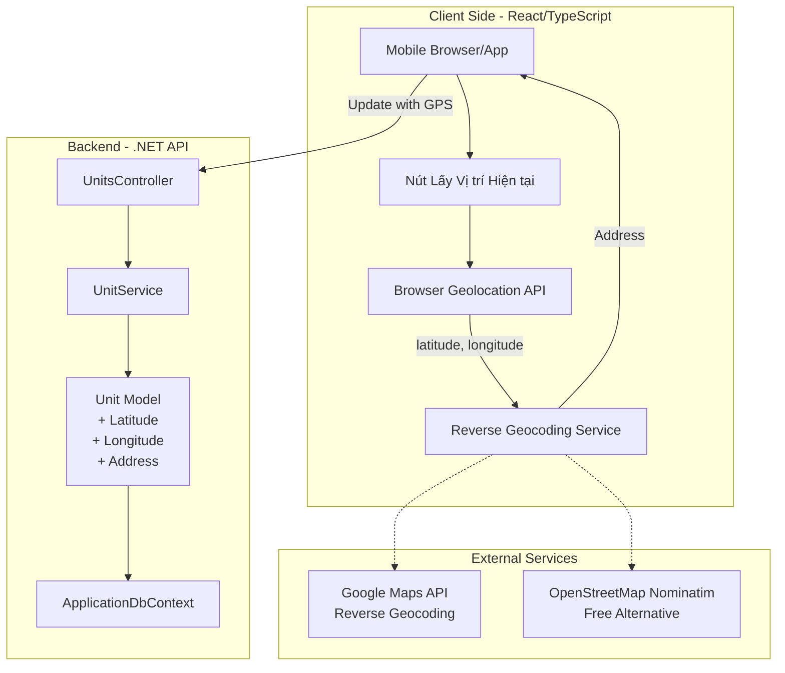
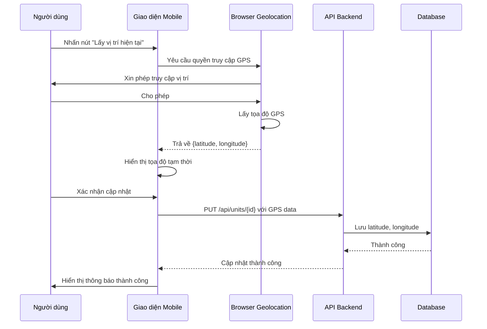
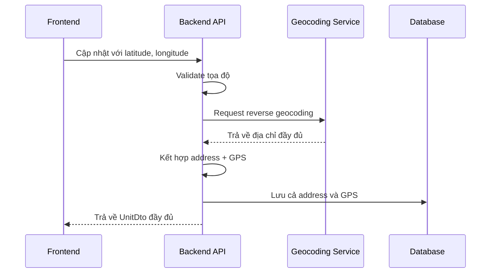

# Kế hoạch: Tính năng Cập nhật Vị trí GPS cho Unit

## Tổng quan

Thêm tính năng cho phép người dùng sử dụng điện thoại để cập nhật vị trí hiện tại (tọa độ GPS) vào đơn vị (Unit) trong hệ thống quản lý IP.

## Yêu cầu

1. Lưu tọa độ GPS (latitude, longitude) cho mỗi Unit
2. Tự động điền địa chỉ từ tọa độ GPS (reverse geocoding)
3. Giao diện thân thiện trên mobile để lấy vị trí hiện tại
4. Hiển thị vị trí trên bản đồ (tùy chọn)

## Kiến trúc hệ thống



## Cấu trúc dữ liệu

### Model Unit (Backend)

Thêm 3 trường mới vào bảng `Units`:

| Trường | Kiểu dữ liệu | Mô tả |
|--------|-------------|-------|
| `Latitude` | `decimal?` | Vĩ độ (-90 đến 90) |
| `Longitude` | `decimal?` | Kinh độ (-180 đến 180) |
| `Address` | `string?` | Đã có, sẽ được tự động điền từ GPS |

**Lưu ý:** Trường `Address` đã tồn tại, chỉ cần cập nhật giá trị khi có GPS mới.

### DTOs

#### UnitCreateRequest
```csharp
public class UnitCreateRequest
{
    // ... các trường hiện tại ...
    public decimal? Latitude { get; set; }
    public decimal? Longitude { get; set; }
}
```

#### UnitUpdateRequest
```csharp
public class UnitUpdateRequest
{
    // ... các trường hiện tại ...
    public decimal? Latitude { get; set; }
    public decimal? Longitude { get; set; }
}
```

#### UnitDto
```csharp
public class UnitDto
{
    // ... các trường hiện tại ...
    public decimal? Latitude { get; set; }
    public decimal? Longitude { get; set; }
}
```

### TypeScript Types (Frontend)

```typescript
export interface Unit {
  id: number;
  externalId: string;
  name: string;
  code?: string;
  address?: string;
  latitude?: number;
  longitude?: number;
  // ... các trường khác ...
}

export interface UnitCreateRequest {
  name: string;
  code?: string;
  address?: string;
  latitude?: number;
  longitude?: number;
  // ... các trường khác ...
}

export interface UnitUpdateRequest {
  name: string;
  code?: string;
  address?: string;
  latitude?: number;
  longitude?: number;
  // ... các trường khác ...
}
```

## Luồng hoạt động

### 1. Lấy vị trí hiện tại từ điện thoại



### 2. Reverse Geocoding (Tự động điền địa chỉ)



## Chi tiết triển khai

### Bước 1: Cập nhật Backend Model

**File:** `IPManagement.API/Models/Unit.cs`

Thêm properties:
```csharp
public decimal? Latitude { get; set; }
public decimal? Longitude { get; set; }
```

### Bước 2: Cập nhật DTOs

**File:** `IPManagement.API/DTOs/UnitDTOs.cs`

Thêm vào `UnitCreateRequest`, `UnitUpdateRequest`, `UnitDto`:
```csharp
public decimal? Latitude { get; set; }
public decimal? Longitude { get; set; }
```

### Bước 3: Tạo Database Migration

Sử dụng Entity Framework Core:
```bash
cd IPManagement.API
dotnet ef migrations add AddUnitGPSFields
dotnet ef database update
```

### Bước 4: Cập nhật UnitService

**File:** `IPManagement.API/Services/UnitService.cs`

Thêm logic:
- Validate latitude (-90 đến 90) và longitude (-180 đến 180)
- Gọi reverse geocoding service khi có GPS mới
- Tự động cập nhật address từ GPS

### Bước 5: Cập nhật Frontend Types

**File:** `IPManagement.Web/src/types/unit.ts`

Thêm fields vào interfaces.

### Bước 6: Tạo Hook GPS

**File:** `IPManagement.Web/src/hooks/useGPS.ts` (mới)

```typescript
import { useState, useCallback } from 'react';

interface GPSPosition {
  latitude: number;
  longitude: number;
  address?: string;
  error?: string;
}

export const useGPS = () => {
  const [loading, setLoading] = useState(false);
  const [position, setPosition] = useState<GPSPosition | null>(null);

  const getCurrentPosition = useCallback(() => {
    setLoading(true);
    
    if (!navigator.geolocation) {
      setPosition({
        latitude: 0,
        longitude: 0,
        error: 'Geolocation không được hỗ trợ bởi trình duyệt này'
      });
      setLoading(false);
      return;
    }

    navigator.geolocation.getCurrentPosition(
      async (success) => {
        setPosition({
          latitude: success.coords.latitude,
          longitude: success.coords.longitude
        });
        setLoading(false);
      },
      (error) => {
        let errorMessage = 'Không thể lấy vị trí hiện tại';
        switch (error.code) {
          case error.PERMISSION_DENIED:
            errorMessage = 'Người dùng đã từ chối quyền truy cập vị trí';
            break;
          case error.POSITION_UNAVAILABLE:
            errorMessage = 'Thông tin vị trí không khả dụng';
            break;
          case error.TIMEOUT:
            errorMessage = 'Yêu cầu lấy vị trí đã hết thời gian';
            break;
        }
        setPosition({
          latitude: 0,
          longitude: 0,
          error: errorMessage
        });
        setLoading(false);
      },
      {
        enableHighAccuracy: true,
        timeout: 10000,
        maximumAge: 0
      }
    );
  }, []);

  return {
    getCurrentPosition,
    loading,
    position
  };
};
```

### Bước 7: Tạo Component GPS Button

**File:** `IPManagement.Web/src/components/GPSLocationButton.tsx` (mới)

```typescript
import { Button, message, Spin } from 'antd';
import { EnvironmentOutlined } from '@ant-design/icons';
import { useGPS } from '../hooks/useGPS';

interface GPSLocationButtonProps {
  onLocationFound: (latitude: number, longitude: number) => void;
  buttonText?: string;
  size?: 'small' | 'middle' | 'large';
}

const GPSLocationButton: React.FC<GPSLocationButtonProps> = ({
  onLocationFound,
  buttonText = 'Lấy vị trí hiện tại',
  size = 'middle'
}) => {
  const { getCurrentPosition, loading, position } = useGPS();

  React.useEffect(() => {
    if (position && position.latitude !== 0 && position.longitude !== 0 && !position.error) {
      message.success(`Đã lấy vị trí: ${position.latitude.toFixed(6)}, ${position.longitude.toFixed(6)}`);
      onLocationFound(position.latitude, position.longitude);
    } else if (position?.error) {
      message.error(position.error);
    }
  }, [position, onLocationFound]);

  return (
    <Button
      icon={<EnvironmentOutlined />}
      onClick={getCurrentPosition}
      loading={loading}
      size={size}
      type="default"
    >
      {loading ? 'Đang lấy vị trí...' : buttonText}
    </Button>
  );
};

export default GPSLocationButton;
```

### Bước 8: Cập nhật UnitDetailPage

Thêm nút GPS vào phần thông tin Unit:

```tsx
import GPSLocationButton from '../components/GPSLocationButton';

// Trong component
const handleLocationFound = (lat: number, lng: number) => {
  // Cập nhật form hoặc state với GPS coordinates
  setUnit({
    ...unit,
    latitude: lat,
    longitude: lng
  });
};

// Trong render
{isMobile && (
  <GPSLocationButton
    onLocationFound={handleLocationFound}
    size="small"
  />
)}
```

## Reverse Geocoding Options

### Option 1: Google Maps Geocoding API (Trả phí)

```csharp
public async Task<string?> ReverseGeocodeAsync(decimal latitude, decimal longitude)
{
    var apiKey = _configuration["GoogleMapsApiKey"];
    var url = $"https://maps.googleapis.com/maps/api/geocode/json?latlng={latitude},{longitude}&key={apiKey}";
    
    var response = await _httpClient.GetStringAsync(url);
    var result = JsonSerializer.Deserialize<GoogleGeocodeResponse>(response);
    
    return result?.Results.FirstOrDefault()?.FormattedAddress;
}
```

### Option 2: OpenStreetMap Nominatim (Miễn phí)

```csharp
public async Task<string?> ReverseGeocodeAsync(decimal latitude, decimal longitude)
{
    var url = $"https://nominatim.openstreetmap.org/reverse?format=json&lat={latitude}&lon={longitude}";
    
    var response = await _httpClient.GetStringAsync(url);
    var result = JsonSerializer.Deserialize<NominatimResponse>(response);
    
    return result?.Display_name;
}
```

**Khuyến nghị:** Sử dụng OpenStreetMap cho phiên bản đầu tiên để không phát sinh chi phí.

## Giao diện Mobile

### Mobile View - Unit Detail

```
┌─────────────────────────────────────┐
│  ← Chi tiết đơn vị                   │
├─────────────────────────────────────┤
│  Tên đơn vị: [____________]         │
│  Mã:       [____________]           │
│  Địa chỉ:  [____________]           │
│              📍 Lấy vị trí hiện tại  │  ← Nút GPS
│                                      │
│  Mô tả:                              │
│  ┌─────────────────────────────┐    │
│  │                             │    │
│  └─────────────────────────────┘    │
│                                      │
│  [Lưu]          [Hủy]               │
└─────────────────────────────────────┘
```

### Mobile View - Sau khi lấy GPS

```
┌─────────────────────────────────────┐
│  Chi tiết đơn vị                     │
├─────────────────────────────────────┤
│  Tên đơn vị: [____________]         │
│  Địa chỉ:  123 Đường ABC, Quận 1    │
│              📍 10.776421, 106.702147│  ← GPS hiển thị
│              ✏️ Chỉnh sửa địa chỉ    │
│                                      │
│  [Lưu thay đổi]                      │
└─────────────────────────────────────┘
```

## Bảo mật

1. **Xác thực người dùng:** Chỉ người dùng có quyền cập nhật Unit mới được thay đổi vị trí
2. **Validate tọa độ:** Kiểm tra latitude (-90 đến 90) và longitude (-180 đến 180)
3. **Rate limiting:** Giới hạn số lần gọi reverse geocoding để tránh lạm dụng
4. **HTTPS bắt buộc:** GPS chỉ hoạt động trên HTTPS hoặc localhost

## Lưu ý quan trọng

1. **HTTPS Requirement:** Browser chỉ cho phép truy cập GPS trên HTTPS hoặc localhost
2. **Permission Handling:** Cần xử lý trường hợp người dùng từ chối quyền truy cập GPS
3. **Mobile Optimization:** Nút GPS nên hiển thị rõ ràng trên mobile
4. **Offline Support:** Cân nhắc lưu GPS tạm thời khi offline và đồng bộ sau
5. **Accuracy:** GPS trên điện thoại có độ chính xác khác nhau, nên hiển thị độ chính xác

## Testing

### Test Cases

1. **Test lấy GPS thành công**
   - Input: Người dùng cho phép truy cập GPS
   - Expected: Hiển thị tọa độ và cập nhật thành công

2. **Test từ chối quyền GPS**
   - Input: Người dùng từ chối truy cập GPS
   - Expected: Hiển thị thông báo hướng dẫn bật GPS trong cài đặt

3. **Test validate tọa độ**
   - Input: Tọa độ ngoài phạm vi hợp lệ
   - Expected: Hiển thị lỗi validate

4. **Test reverse geocoding**
   - Input: Tọa độ hợp lệ
   - Expected: Địa chỉ được tự động điền

## Timeline triển khai

| Bước | Mô tả | Độ ưu tiên |
|------|-------|------------|
| 1 | Cập nhật Model và DTOs | Cao |
| 2 | Tạo Database Migration | Cao |
| 3 | Cập nhật UnitService | Cao |
| 4 | Cập nhật Frontend Types | Cao |
| 5 | Tạo GPS Hook và Component | Cao |
| 6 | Tích hợp vào UnitDetailPage | Cao |
| 7 | Thêm Reverse Geocoding | Trung bình |
| 8 | Testing và tối ưu mobile | Trung bình |
| 9 | Documentation | Thấp |

## Kết luận

Tính năng này sẽ giúp người dùng trên điện thoại dễ dàng cập nhật vị trí chính xác của đơn vị mà không cần nhập địa chỉ thủ công. Việc tích hợp GPS sẽ cải thiện trải nghiệm người dùng trên mobile và tăng độ chính xác của dữ liệu vị trí trong hệ thống.